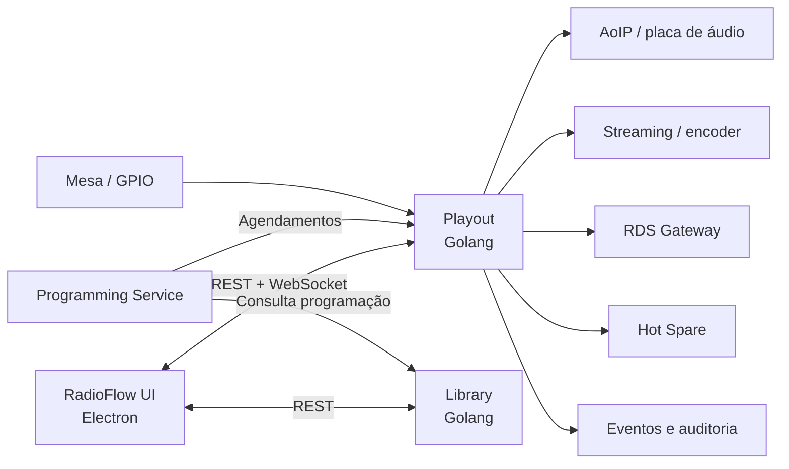
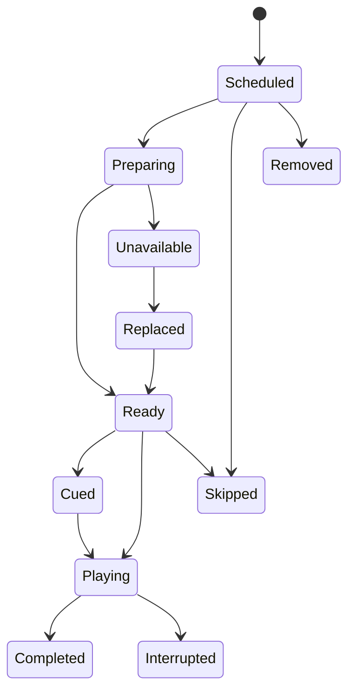
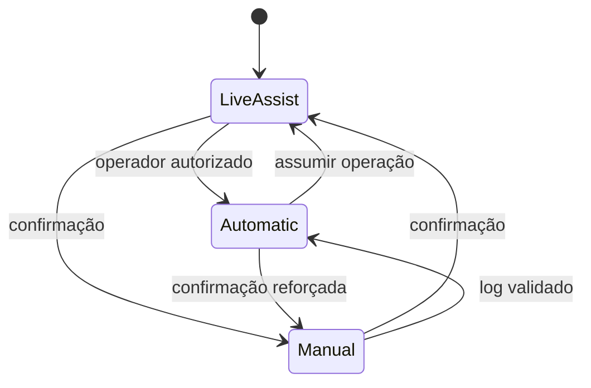
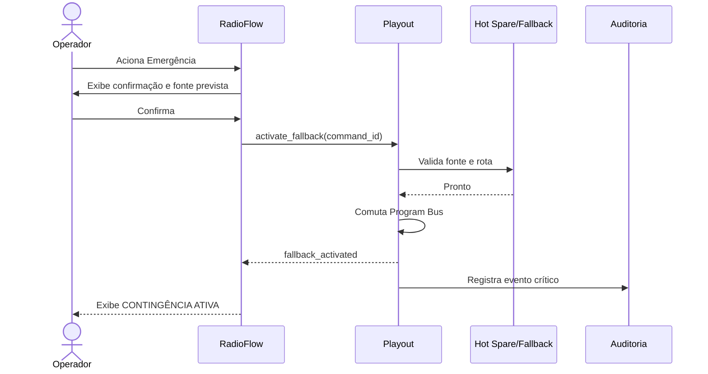

# Audion Playout — Especificação Funcional da Interface **No Ar**

**Documento:** `no-ar.md`  
**Versão:** 1.0  
**Data:** 15 de julho de 2026  
**Status:** Especificação funcional e de experiência operacional  
**Referência visual:** `audion-enterprise-playout.html`

---

## 1. Objetivo

Este documento descreve em detalhes a interface **No Ar** do Audion Playout, incluindo:

- finalidade de cada componente visual;
- comportamento esperado em operação real;
- fluxos de uso do locutor, operador, produtor e técnico;
- regras de negócio da automação;
- estados e transições do player;
- integração com o Playout, Library e serviços de programação;
- tratamento de falhas e operação degradada;
- suporte a múltiplas telas;
- requisitos de segurança, auditoria, acessibilidade e desempenho.

A interface foi concebida para operação contínua em emissoras de grande porte, nas quais rapidez, previsibilidade, baixa carga cognitiva e prevenção de erro são mais importantes do que densidade de funcionalidades sem hierarquia.

O workspace **No Ar** deve permitir que o operador responda, em poucos segundos, às seguintes perguntas:

1. O que está no ar neste momento?
2. Quanto tempo falta para terminar?
3. Qual é o próximo item?
4. O próximo item está pronto para tocar?
5. Existe algum evento obrigatório ou hard time se aproximando?
6. O áudio está íntegro?
7. O sistema principal e a redundância estão saudáveis?
8. Qual ação é segura executar agora?

---

## 2. Escopo

### 2.1 Incluído

A especificação cobre:

- cabeçalho global;
- navegação lateral;
- log operacional;
- resumo do próximo break;
- deck principal;
- deck do próximo item;
- controles de transporte;
- Hot Keys;
- Voice Track;
- roteamento rápido;
- notas operacionais;
- modos de operação;
- medidores de áudio;
- contexto do programa;
- saúde e alertas;
- rodapé técnico;
- fallback de emergência;
- operação multiestação e multitela;
- integração com os workspaces Produção e Engenharia.

### 2.2 Fora do escopo detalhado

Os seguintes módulos aparecem na navegação, mas devem possuir especificações próprias:

- Grade e programação;
- Tráfego comercial;
- Gravação e ingest;
- Relatórios e compliance;
- Administração, configuração e permissões;
- edição avançada de clocks;
- edição completa de metadados de assets;
- configuração da matriz AoIP;
- gestão de usuários, perfis e autenticação.

Este documento descreve apenas os pontos de integração desses módulos com a operação **No Ar**.

---

## 3. Princípios de projeto

### 3.1 Segurança operacional

Toda ação que possa interromper, substituir ou alterar a saída principal deve:

- indicar claramente o efeito antes da execução;
- exigir confirmação quando o impacto for crítico;
- produzir feedback visual imediato;
- ser confirmada pelo backend;
- gerar evento de auditoria;
- possuir tratamento de timeout e rejeição;
- ser idempotente quando tecnicamente possível.

### 3.2 Fonte de verdade

A interface não é a fonte de verdade da reprodução.

- O **Playout**, executado em Golang, é responsável pela reprodução, fila operacional, agendamentos já aceitos, transições, áudio, watchdog e estado efetivo dos players.
- O **RadioFlow**, executado em Electron, exibe o estado, envia comandos e recebe eventos.
- O **Library**, executado em Golang, é responsável por catálogo, metadados, assets, playlists, blocos comerciais e perfis de botoeira.
- O **Programming Service** lê a programação no Library e entrega os agendamentos ao Playout.

A UI pode apresentar um estado transitório como “comando enviado”, mas só deve mostrar “executado” após receber confirmação do Playout.

### 3.3 Hierarquia visual

A ordem de importância deve ser:

1. estado de transmissão e alertas críticos;
2. item atual e tempo restante;
3. próximo item e prontidão;
4. eventos obrigatórios e breaks;
5. log operacional;
6. controles de intervenção;
7. contexto editorial;
8. telemetria e informações secundárias.

### 3.4 Baixa carga cognitiva

- Os elementos críticos devem permanecer em posições fixas.
- Cores devem representar estado, nunca apenas decoração.
- Ações perigosas não devem ficar próximas de ações rotineiras sem diferenciação.
- O sistema deve evitar modais desnecessários durante operação normal.
- Informações técnicas profundas devem ser acessíveis, mas não dominar a tela do locutor.

### 3.5 Operação por teclado, mouse e touchscreen

Todas as ações frequentes devem ser possíveis por:

- mouse;
- touchscreen;
- teclado;
- superfície de controle ou GPIO, quando configurado.

Os comandos críticos precisam possuir atalhos configuráveis e proteção contra acionamento acidental.

---

## 4. Personas e permissões

### 4.1 Locutor

Responsável por:

- acompanhar o item atual e o próximo;
- abrir e fechar microfone;
- disparar Hot Keys autorizadas;
- inserir conteúdo permitido;
- gravar Voice Track;
- operar em Live Assist;
- registrar notas do programa.

Normalmente não deve possuir permissão para:

- alterar matriz de áudio permanente;
- editar clocks corporativos;
- modificar regras comerciais;
- desativar redundância;
- alterar configurações do Playout.

### 4.2 Operador

Possui as capacidades do locutor e também pode:

- reordenar itens do log dentro dos limites permitidos;
- pular, segurar, remover ou inserir itens;
- mudar modo operacional;
- reconciliar a programação;
- acionar contingência;
- operar fontes externas e codecs.

### 4.3 Produtor

Pode:

- preparar playlists;
- selecionar assets;
- editar notas;
- preparar Hot Keys;
- criar e revisar Voice Tracks;
- validar conteúdo antes de enviá-lo ao Playout.

O produtor não deve interferir diretamente na saída principal sem permissão operacional.

### 4.4 Técnico ou engenheiro

Pode:

- visualizar telemetria completa;
- alterar rotas autorizadas;
- operar redundância;
- reiniciar componentes;
- colocar nós em manutenção;
- executar diagnóstico;
- investigar eventos técnicos.

### 4.5 Supervisor

Pode:

- assumir controle de um estúdio;
- aprovar ações críticas;
- desbloquear logs protegidos;
- autorizar exceções;
- consultar auditoria;
- alterar perfis e políticas operacionais.

---

## 5. Arquitetura funcional



### 5.1 Responsabilidade do RadioFlow

- renderizar a interface;
- manter sessão e preferências do usuário;
- consumir estado e eventos;
- enviar comandos ao Playout;
- consultar o catálogo no Library;
- apresentar notificações;
- coordenar múltiplas janelas;
- nunca realizar a reprodução principal dentro do processo de interface.

### 5.2 Responsabilidade do Playout

- decodificar e reproduzir áudio;
- manter players, filas e agendamentos;
- garantir transições e precisão temporal;
- aplicar cue-in, segue, outro, fade e ganho;
- controlar Program Bus e PFL quando aplicável;
- executar eventos hard time;
- manter watchdog e fallback;
- publicar o estado efetivo em tempo real;
- rejeitar comandos inválidos ou inseguros.

### 5.3 Responsabilidade do Library

- armazenar metadados e referências de assets;
- validar disponibilidade do arquivo;
- fornecer playlists, breaks, perfis de Hot Keys e clocks;
- manter ISRC, categoria, duração, loudness, validade e restrições;
- informar assets indisponíveis, expirados ou em processamento.

---

## 6. Modelo de sincronização da interface

### 6.1 Snapshot inicial

Ao abrir a tela, o RadioFlow deve obter um snapshot contendo no mínimo:

- emissora e estúdio ativos;
- estado do Playout;
- modo operacional;
- item atual;
- próximo item;
- fila operacional;
- eventos agendados próximos;
- estado do Program Bus;
- estado dos players;
- estado do Hot Spare;
- alertas ativos;
- versão da fila;
- relógio de referência do Playout.

### 6.2 Atualizações incrementais

Após o snapshot, a UI deve consumir eventos via WebSocket ou canal equivalente.

Eventos recomendados:

- `playout.state_changed`;
- `playout.track_started`;
- `playout.track_progress`;
- `playout.track_ended`;
- `playout.queue_changed`;
- `playout.mode_changed`;
- `playout.command_acknowledged`;
- `playout.command_rejected`;
- `audio.meter_updated`;
- `audio.route_changed`;
- `audio.silence_detected`;
- `scheduler.event_due`;
- `scheduler.event_executed`;
- `library.asset_changed`;
- `ha.state_changed`;
- `alarm.opened`;
- `alarm.acknowledged`;
- `alarm.resolved`.

### 6.3 Reconexão

Quando o WebSocket cair:

1. a UI deve indicar “Reconectando” sem ocultar o último estado conhecido;
2. comandos destrutivos devem ser desabilitados;
3. comandos locais permitidos devem ser definidos por política;
4. a UI deve tentar reconectar com backoff limitado;
5. após reconectar, deve solicitar novo snapshot;
6. o estado local antigo deve ser descartado se a versão da fila divergir;
7. qualquer comando sem confirmação deve aparecer como “resultado desconhecido” até reconciliação.

---

## 7. Estrutura geral da interface

A tela é dividida em cinco regiões:

1. **Cabeçalho global** — contexto da emissora e estado macro;
2. **Navegação lateral** — acesso aos workspaces e módulos;
3. **Área principal No Ar** — operação em tempo real;
4. **Rodapé técnico** — conectividade e recursos do host;
5. **Camadas temporárias** — popovers, modais e notificações.

Na visualização desktop de três colunas:

- coluna esquerda: log e próximo break;
- coluna central: item atual, próximo item e ferramentas rápidas;
- coluna direita: modo, medidores, contexto e alertas.

Essa composição mantém o elemento mais importante — o deck atual — na região central e com maior área visual.

---

# 8. Cabeçalho global

## 8.1 Marca e identificação do produto

### Finalidade

Identificar rapidamente o sistema e evitar confusão com outras ferramentas abertas na mesma estação.

### Comportamento

- Deve exibir produto, ambiente e edição.
- Em ambientes não produtivos, deve haver identificação persistente, por exemplo: `HOMOLOGAÇÃO`.
- A versão completa deve estar disponível no tooltip ou painel “Sobre”.

### Regra de negócio

O ambiente de teste nunca deve utilizar exatamente a mesma combinação visual do ambiente de produção.

---

## 8.2 Seletor de emissora

### Finalidade

Permitir ao usuário alternar o contexto entre emissoras, canais ou operações autorizadas.

### Comportamento esperado

Ao selecionar uma emissora:

1. a UI verifica se o usuário possui permissão;
2. confirma se existe uma ação crítica em andamento;
3. busca o snapshot da emissora selecionada;
4. troca todos os componentes de forma atômica;
5. atualiza o contexto de Hot Keys, Library, log, notas e alertas;
6. registra a mudança na auditoria.

### Regras de negócio

- A troca não altera automaticamente qual emissora está fisicamente no ar no estúdio.
- “Visualizar emissora” e “assumir controle” são permissões diferentes.
- Se o usuário estiver com o controle operacional ativo, a troca de emissora pode exigir confirmação.
- A interface deve impedir que comandos destinados à emissora anterior sejam enviados após a troca.
- Todo comando deve conter `station_id`, `studio_id` e `session_id`.

### Estado recomendado

- **Visualização:** usuário apenas acompanha;
- **Controle:** usuário pode comandar;
- **Controle remoto:** usuário opera fora do estúdio;
- **Somente contingência:** apenas ações de emergência habilitadas.

---

## 8.3 Chips de estado

O protótipo apresenta:

- `NO AR`;
- `Áudio íntegro`;
- `Sync 12 ms`.

### 8.3.1 NO AR

Deve refletir a condição real do Program Bus ou sinal de confirmação configurado.

Possíveis estados:

| Estado | Significado |
|---|---|
| No ar | Saída principal confirmada |
| Fora do ar | Não existe confirmação de saída |
| Em contingência | Fallback ou Hot Spare está alimentando a saída |
| Em manutenção | Operação intencionalmente retirada |
| Desconhecido | Telemetria insuficiente |

A indicação “No ar” não deve depender apenas de o player estar em `PLAYING`. Ela deve considerar, quando disponível, presença de áudio, rota, encoder/STL e retorno de confiança.

### 8.3.2 Áudio íntegro

Deve consolidar:

- presença de sinal;
- ausência de silêncio além do limite;
- ausência de clipping persistente;
- sincronismo de canais;
- buffer saudável;
- ausência de underrun;
- formato de áudio esperado.

### 8.3.3 Sync

Representa a latência ou defasagem entre a UI e o Playout.

Regras sugeridas:

- verde: até 50 ms;
- amarelo: de 51 a 200 ms;
- vermelho: acima de 200 ms ou sem heartbeat.

Os limites devem ser configuráveis por ambiente.

---

## 8.4 Condições do estúdio

Exibe temperatura e umidade quando sensores estiverem disponíveis.

### Regras

- Informação ambiental é secundária e não deve competir com alertas de transmissão.
- Valores fora dos limites podem gerar aviso técnico.
- Falha de sensor deve exibir `indisponível`, nunca valor antigo sem indicação.

---

## 8.5 Relógio e data

### Fonte temporal

O relógio deve ser sincronizado com a mesma referência temporal usada pelo Playout, preferencialmente NTP/PTP conforme a infraestrutura.

### Regras

- Deve usar o fuso da emissora ou operação, não necessariamente o fuso do computador do usuário.
- Eventos hard time devem usar o relógio do Playout.
- A UI deve mostrar aviso quando a diferença entre o host e o Playout exceder o limite.
- Horário deve usar algarismos tabulares para evitar deslocamento visual.

---

## 8.6 Gerenciador de múltiplas telas

O botão `▣` abre as opções:

- Tela 1 — Operação No Ar;
- Tela 2 — Produção;
- Tela 3 — Engenharia.

### Comportamento de produção

- Cada workspace pode ser aberto em uma janela Electron independente.
- As janelas devem compartilhar a mesma sessão autenticada.
- O estado deve permanecer sincronizado entre todas as janelas.
- A posição, o tamanho e o monitor devem ser persistidos por usuário e estação.
- Ao reconectar monitores, janelas fora da área visível devem ser reposicionadas automaticamente.
- Fechar uma janela secundária não deve interromper áudio ou sessão principal.
- A janela **No Ar** pode ser configurada como sempre visível e impedir fechamento acidental durante turno ativo.

### Perfis de layout sugeridos

#### Perfil de uma tela

- todos os componentes No Ar;
- Produção e Engenharia acessadas pela navegação;
- painéis menos críticos recolhíveis.

#### Perfil de duas telas

- Tela 1: No Ar;
- Tela 2: Biblioteca, produção, comunicação e engenharia compacta.

#### Perfil de três telas

- Tela 1: No Ar;
- Tela 2: Produção e Library;
- Tela 3: Engenharia, alarmes, streams e redundância.

#### Perfil de quatro telas

- Tela 1: No Ar;
- Tela 2: Log expandido e conteúdo;
- Tela 3: Produção e comunicação;
- Tela 4: Engenharia e retorno de confiança.

---

## 8.7 Central de alertas

O botão `◉` deve abrir a central completa, e não apenas rolar a tela.

A central deve permitir:

- filtrar por severidade;
- visualizar origem e impacto;
- reconhecer alertas;
- abrir runbook;
- acessar diagnóstico;
- silenciar notificações não críticas por período autorizado;
- consultar histórico;
- vincular incidente.

Regras de severidade:

| Severidade | Exemplo | Tratamento |
|---|---|---|
| Crítica | silêncio no Program Bus | persistente, sonora e não silenciável sem reconhecimento |
| Alta | Hot Spare indisponível | destaque persistente |
| Média | asset próximo da expiração | aviso operacional |
| Baixa | atualização disponível | informativa |

---

## 8.8 Perfil do operador

Deve mostrar:

- usuário autenticado;
- função ativa;
- estúdio e emissora;
- nível de controle;
- início do turno;
- opção de bloquear estação;
- troca de usuário;
- entrega de turno;
- preferências de layout e atalhos.

O logout não deve interromper o Playout. Ele apenas remove o controle da sessão atual.

---

# 9. Navegação lateral

## 9.1 No Ar

É o workspace principal para operação em tempo real.

Ao entrar, o foco inicial deve ir para o deck atual ou log, conforme preferência do operador. Alertas críticos precisam permanecer visíveis independentemente do workspace.

## 9.2 Produção

Abre Library, preview, playlists e clocks.

Regra: preview deve usar PFL ou dispositivo de monitoração, nunca Program Bus, salvo ação explícita e autorizada.

## 9.3 Engenharia

Exibe telemetria, topologia, rotas e eventos técnicos.

Apenas usuários autorizados podem executar ações de infraestrutura.

## 9.4 Grade

Integra com programação e clocks. Deve permitir consultar, mas alterações publicadas precisam seguir workflow de aprovação quando configurado.

## 9.5 Tráfego

Integra com blocos comerciais, contratos, validade e reconciliação. A operação No Ar recebe os breaks já preparados e validados.

## 9.6 Gravar

Acesso a ingest, gravação de programas, chamadas, Voice Tracks e conteúdos externos.

## 9.7 Relatórios

Acesso a relatório de irradiação, auditoria, conformidade, ECAD e falhas de execução.

## 9.8 Configuração

Acesso controlado a:

- áudio;
- dispositivos;
- GPIO;
- perfis;
- permissões;
- layouts;
- integrações;
- políticas de contingência.

---

# 10. Log operacional

## 10.1 Finalidade

O log representa a sequência operacional prevista e efetiva do canal. Ele deve combinar:

- programação recebida;
- itens executados;
- item atual;
- próximos itens;
- inserções manuais;
- eventos técnicos;
- markers e comandos;
- breaks comerciais;
- eventos hard time;
- conteúdo ao vivo.

O log da UI é uma projeção do estado mantido pelo Playout e pelos serviços de programação.

---

## 10.2 Informações de cada linha

Cada item deve poder apresentar:

- horário planejado;
- horário estimado;
- horário efetivo;
- tipo;
- título;
- artista ou anunciante;
- duração;
- status;
- origem;
- categoria;
- cue-in;
- segue;
- outro;
- fade;
- ganho;
- prioridade;
- hard/soft time;
- validade;
- indicador de conteúdo obrigatório;
- indicador de alteração manual;
- conflito ou alerta;
- responsável pela última alteração.

### Exibição compacta

A linha principal deve priorizar:

- horário;
- tipo por cor e ícone;
- título;
- duração;
- status.

Dados adicionais devem aparecer em painel lateral, expansão ou tooltip.

---

## 10.3 Estados de um item



Estados recomendados:

| Estado | Significado |
|---|---|
| Scheduled | agendado, ainda fora da janela de preparação |
| Preparing | carregando ou validando |
| Ready | pronto para reprodução |
| Cued | pré-carregado no player |
| Playing | em reprodução |
| Completed | finalizado normalmente |
| Interrupted | interrompido após iniciar |
| Skipped | pulado antes de iniciar |
| Removed | removido do log |
| Unavailable | asset ou fonte indisponível |
| Replaced | substituído por outro item |
| Failed | tentativa de execução falhou |

---

## 10.4 Cores por tipo

As cores devem ser configuráveis, mas consistentes em toda a suíte.

Exemplo:

- música: ciano ou azul;
- spot: âmbar;
- vinheta ou imaging: magenta;
- Voice Track: roxo;
- notícia ou conteúdo falado: vermelho controlado;
- evento técnico: cinza;
- fonte ao vivo: verde;
- item inválido: vermelho de erro.

A cor nunca deve ser o único meio de identificação. Cada tipo deve possuir texto e/ou ícone.

---

## 10.5 Busca no log

A busca deve localizar por:

- título;
- artista;
- anunciante;
- identificador;
- horário;
- tipo;
- categoria;
- observação.

### Regra

Filtrar visualmente não altera a fila. Enquanto houver filtro ativo, a UI deve deixar claro que alguns itens estão ocultos.

---

## 10.6 Hoje e amanhã

Permitem alternar a janela de programação.

### Regras

- O log atual deve sempre indicar a data exibida.
- O usuário não pode confundir o log de amanhã com a operação ativa.
- Ações operacionais sobre o log futuro devem exigir permissão adequada.
- Alterar a visualização de data não muda o contexto efetivo do Playout.

---

## 10.7 Bloqueio do log

O botão `Livre/Bloqueado` controla alterações manuais.

### Quando bloqueado

Devem ser impedidos:

- drag-and-drop;
- remoção;
- alteração de horário;
- substituição;
- inserção não emergencial;
- edição de parâmetros.

Podem continuar permitidos, conforme perfil:

- preview;
- consulta de detalhes;
- disparo do próximo item;
- comandos de emergência.

### Regras

- Bloqueio pode ser local, por turno, por programa ou corporativo.
- Eventos obrigatórios podem permanecer protegidos mesmo com o log livre.
- Desbloqueio pode exigir PIN ou autorização de supervisor.
- Toda alteração deve registrar antes, depois, motivo e usuário.

---

## 10.8 Inserir item

O botão `Inserir` abre a Library no contexto de inserção.

### Fluxo padrão

1. usuário aciona `Inserir`;
2. Library abre com filtros do canal;
3. usuário pesquisa e executa preview;
4. seleciona posição de inserção;
5. sistema valida disponibilidade e restrições;
6. Playout recebe comando com versão esperada da fila;
7. Playout confirma nova versão;
8. UI destaca o item inserido;
9. auditoria registra a alteração.

### Posição padrão

O protótipo insere após o item atual. Em produção, a posição deve ser explícita ou determinada por regra:

- após o atual;
- antes do próximo;
- em posição selecionada;
- dentro de break selecionado;
- em horário específico;
- como item de prioridade.

### Validações

- asset disponível localmente;
- asset não expirado;
- formato suportado;
- duração conhecida;
- permissão de uso no canal;
- conflito com hard time;
- regras de separação musical;
- limite máximo da fila operacional;
- duplicidade indevida;
- direitos ou restrições editoriais.

---

## 10.9 Reordenação por drag-and-drop

### Regras

- Só deve funcionar quando o log estiver livre.
- Item atual não pode ser reposicionado.
- Itens executados são imutáveis.
- Um item hard time só pode ser movido dentro da tolerância autorizada.
- Break comercial protegido não pode ter peças reordenadas sem permissão de tráfego.
- A UI deve mostrar posição de destino e impacto estimado.
- Antes de confirmar, deve exibir conflitos criados pela mudança.
- O backend deve usar controle de concorrência pela versão da fila.

### Concorrência

Exemplo:

```text
Comando: mover item QI-103 antes de QI-101
Versão esperada: 457
Versão atual no Playout: 458
Resultado: rejeitado por conflito
Ação da UI: atualizar fila e solicitar nova tentativa
```

---

## 10.10 Duplo clique para carregar

No protótipo, o duplo clique carrega um item no player.

Em produção, esse comportamento deve ser configurável, porque duplo clique pode causar erro operacional.

Opções recomendadas:

- duplo clique abre detalhes;
- `Enter` prepara o item;
- comando dedicado `Carregar no próximo player`;
- duplo clique só permitido em ambiente de treinamento.

Quando utilizado para carregar:

- não deve iniciar automaticamente sem configuração explícita;
- deve validar se o player está disponível;
- deve preservar o item atual;
- deve indicar claramente qual deck recebeu o item.

---

## 10.11 Reconciliar

Compara o log operacional do Playout com a programação central.

### O processo deve identificar

- itens ausentes;
- itens extras;
- alterações manuais;
- versões divergentes;
- assets substituídos;
- breaks incompletos;
- alterações de duração;
- eventos hard time em risco;
- programação ainda não recebida.

### Resultado

A reconciliação não deve sobrescrever mudanças automaticamente sem política explícita. Deve apresentar opções:

- manter operação local;
- aplicar programação central;
- mesclar;
- enviar alteração local para aprovação;
- adiar decisão.

---

# 11. Resumo do próximo break

## 11.1 Finalidade

Dar visibilidade antecipada ao próximo bloco comercial ou compromisso obrigatório.

Deve apresentar:

- horário nominal;
- tempo restante;
- quantidade de peças;
- duração total;
- tolerância;
- estado de validação;
- origem do tráfego;
- possíveis conflitos.

## 11.2 Contagem regressiva

A contagem deve usar o relógio do Playout e considerar:

- horário fixo do break;
- duração restante do item atual;
- itens intermediários;
- regras de segue;
- alterações manuais;
- atraso ou adiantamento acumulado.

## 11.3 Estados do break

| Estado | Comportamento |
|---|---|
| Preparado | todas as peças disponíveis e validadas |
| Incompleto | uma ou mais peças ausentes |
| Em risco | previsão ultrapassa tolerância |
| Armado | carregado para execução |
| Em execução | bloco no ar |
| Concluído | todas as peças executadas |
| Parcial | uma ou mais peças não executadas |
| Perdido | janela obrigatória não atendida |

## 11.4 Regras comerciais

- Peças obrigatórias não devem ser removidas por usuário sem permissão.
- Ordem pode ser protegida pelo tráfego.
- Datas de validade devem ser verificadas antes da preparação.
- Um spot expirado deve ser bloqueado, salvo política formal de exceção.
- A UI deve avisar com antecedência configurável sobre breaks em risco.
- A execução deve alimentar o relatório de irradiação com horário efetivo.

---

# 12. Deck principal — Tocando agora

## 12.1 Finalidade

É o centro da operação. Deve exibir o item efetivamente reproduzido pelo Playout, e não apenas o item selecionado na interface.

## 12.2 Identificação da fonte

Exemplo: `Player A · Saída principal`.

Deve informar:

- player ou deck;
- bus de destino;
- dispositivo de áudio;
- origem do item;
- estado de redundância;
- se o áudio é arquivo, stream, entrada ao vivo ou fallback.

## 12.3 Tipo, título e artista

- Título deve ter maior destaque visual.
- Artista, anunciante ou origem aparece como informação secundária.
- Tipo e categoria ajudam o operador a antecipar o comportamento de transição.
- Texto longo deve ser truncado visualmente, com conteúdo completo no tooltip.

## 12.4 Metadados técnicos

O protótipo mostra:

- início;
- cue;
- outro;
- ganho;
- ISRC.

### Início

Horário efetivo em que o primeiro frame audível foi enviado ao Program Bus.

### Cue-in

Ponto a partir do qual o item deve iniciar. O Playout deve respeitar precisão de amostra ou frame conforme o formato interno.

### Segue

Ponto em que o próximo item pode iniciar automaticamente.

### Outro

Duração ou ponto que indica a região final útil para locução e transição.

### Ganho

Ajuste aplicado ao asset, sem substituir processamento final de áudio.

### ISRC

Identificador fonográfico usado para relatórios e integrações de direitos quando disponível.

### Regras

- Metadados usados em reprodução devem vir do snapshot do Playout.
- Alterações no Library durante a reprodução não podem modificar o item atual sem comando explícito.
- Valores ausentes devem ser indicados como não definidos, não como zero.

---

## 12.5 Waveform

### Finalidade

Permitir percepção rápida da estrutura do áudio, regiões silenciosas e pontos de transição.

### Elementos

- forma de onda completa ou janela móvel;
- cursor de reprodução;
- cue-in;
- segue;
- outro;
- marcadores;
- região já executada;
- clipping ou silêncio detectado;
- zoom opcional.

### Funcionamento

A waveform deve ser pré-calculada pelo Library durante o ingest e fornecida como dados compactos. A UI não deve decodificar o arquivo completo apenas para desenhá-la.

Durante a reprodução:

- o Playout fornece posição temporal;
- a UI move o cursor;
- a frequência de atualização visual pode ser inferior à frequência do áudio;
- o cursor deve ser suavizado sem inventar estado quando houver atraso.

### Regra

A posição do cursor é informativa. O operador não deve conseguir buscar livremente no item em execução sem comando específico e permissão.

---

## 12.6 Progresso e tempos

A tela apresenta:

- tempo decorrido;
- tempo restante;
- duração total.

### Tempo decorrido

Tempo reproduzido desde o cue-in efetivo.

### Tempo restante

Deve ser o contador visual mais proeminente. Pode mudar de cor por limiares:

- normal;
- atenção ao entrar no outro;
- crítico nos últimos segundos;
- overtime quando ultrapassa duração planejada em fonte ao vivo.

### Duração

Duração efetiva entre cue-in e cue-out, não necessariamente o tamanho bruto do arquivo.

### Precisão

- atualização visual mínima sugerida: 10 Hz para cursor e 1 Hz para texto;
- o texto pode usar décimos nos últimos 10 segundos;
- a contagem deve usar timestamp do Playout para evitar deriva.

---

# 13. Controles de transporte

## 13.1 Voltar

No protótipo, retorna 10 segundos.

Em produção, a semântica deve ser configurada e muito clara:

- reiniciar item;
- voltar N segundos;
- retornar ao cue-in;
- carregar item anterior.

### Regra recomendada

Durante transmissão, o botão não deve executar busca destrutiva por um único toque sem política. Recomenda-se:

- clique: abre opções rápidas;
- atalho dedicado: retorna 5 ou 10 segundos;
- pressionar e segurar: scrub controlado;
- reinício do item: confirmação em conteúdos comerciais ou obrigatórios.

## 13.2 Pausar

### Regras

- Pode ser desabilitado em modo Automático ou para itens obrigatórios.
- Pausar arquivo não significa silenciar Program Bus; outro player ou fonte pode continuar.
- A UI deve indicar `PAUSADO` de forma inequívoca.
- O sistema deve decidir se a pausa congela ou não eventos hard time. Normalmente, hard times permanecem ativos.
- Um item pausado perto de hard time pode ser automaticamente interrompido conforme política.

## 13.3 Continuar ou reproduzir

- Envia comando ao Playout.
- Deve exibir estado `enviando` até ACK.
- Em caso de rejeição, exibe motivo.
- Se o item não estiver preparado, o Playout pode preparar e iniciar ou rejeitar conforme SLA.
- O comando deve possuir `command_id` único.

## 13.4 Próximo

### Fluxo

1. operador aciona;
2. UI mostra confirmação imediata não conclusiva;
3. Playout valida se existe próximo item pronto;
4. aplica transição configurada;
5. publica `track_started`;
6. UI atualiza decks e log;
7. item anterior é marcado como concluído ou interrompido.

### Regras

- Se o próximo item estiver indisponível, o comando deve ser bloqueado ou usar fallback conforme política.
- Em break comercial, pular uma peça pode exigir confirmação e motivo.
- Em Manual, o comando é a forma normal de avançar.
- Em Live Assist, pode disparar transição antecipada.
- Em Automático, representa override manual e deve ser auditado.

## 13.5 Emergência

Abre um modal de confirmação para ativar fallback protegido.

Esta ação é descrita em detalhe na seção 24.

---

# 14. Deck do próximo item

## 14.1 Finalidade

Permitir que o operador confirme visualmente o que entrará no ar e se está pronto.

Deve mostrar:

- título;
- artista ou origem;
- duração;
- tipo;
- player de destino;
- estado de preparação;
- transição;
- normalização;
- alertas;
- horário estimado de entrada.

## 14.2 Estado de prontidão

Estados visuais sugeridos:

- **Pronto:** asset carregado e validado;
- **Preparando:** pré-carregamento em andamento;
- **Aguardando:** fora da janela de preparação;
- **Indisponível:** arquivo ou fonte inacessível;
- **Conflito:** regra ou hard time impede execução normal;
- **Substituição pronta:** fallback do item carregado.

## 14.3 Segue automático

Indica que o Playout iniciará o próximo item no ponto de segue do atual.

A UI deve mostrar quando o segue estiver:

- habilitado;
- desabilitado;
- temporariamente suspenso;
- sobrescrito pelo operador.

## 14.4 Fade

Deve indicar o tipo e duração da transição:

- cut;
- fade-in;
- fade-out;
- crossfade;
- segue sobre outro;
- ducking;
- transição customizada.

## 14.5 Normalizado

Indica que o asset possui análise válida e ganho aplicado. Não garante, por si só, que a saída final esteja dentro do alvo; o processamento e os medidores continuam sendo necessários.

---

# 15. Ferramentas rápidas

## 15.1 Hot Keys

Hot Keys são botões para disparo imediato de áudio ou comando.

### Exemplos

- vinheta;
- efeito;
- chamada;
- trilha de fundo;
- hora certa;
- sweep;
- comando GPIO;
- abertura de microfone;
- acionamento de fonte externa.

### Dados de cada Hot Key

- nome;
- tecla associada;
- tipo;
- duração;
- asset ou ação;
- bus de destino;
- modo de disparo;
- prioridade;
- grupo;
- cor;
- permissão;
- política de repetição.

### Modos de disparo

- **One shot:** toca até o fim;
- **Hold:** toca enquanto pressionado;
- **Toggle:** primeiro acionamento inicia, segundo interrompe;
- **Retrigger:** reinicia quando acionado novamente;
- **Queue:** enfileira no bus escolhido;
- **Exclusive:** interrompe outro item do mesmo grupo;
- **Duck:** reduz automaticamente o Program Bus;
- **Command:** executa ação sem áudio.

### Regras

- Teclas não devem disparar quando o foco estiver em campo de texto.
- Perfis podem variar por programa, locutor, estúdio e emissora.
- O asset deve estar pré-carregado quando a latência for crítica.
- Falha de disparo deve ser visível imediatamente.
- Disparos no Program Bus devem ser auditados.
- A UI deve mostrar Hot Key em reprodução e tempo restante.
- Atalhos conflitantes devem ser bloqueados na configuração.

---

## 15.2 Voice Track

A interface possui três blocos:

1. saída anterior;
2. gravação do locutor;
3. entrada seguinte.

### Objetivo

Permitir ao locutor gravar uma intervenção ouvindo a saída da música anterior e preparando a entrada da próxima, criando uma transição natural para operação automática.

### Fluxo

1. selecionar posição entre dois itens;
2. carregar a cauda do item anterior;
3. carregar a introdução do item seguinte;
4. definir ponto de entrada da gravação;
5. armar microfone e PFL;
6. iniciar gravação;
7. reproduzir contexto simulado nos fones;
8. finalizar gravação;
9. revisar mix;
10. refazer ou aprovar;
11. salvar asset no Library;
12. inserir referência no log;
13. sincronizar para o Playout.

### Regras

- A gravação nunca deve ir ao Program Bus durante produção offline.
- Formato recomendado: PCM/WAV de produção ou codec lossless definido pela plataforma.
- A UI deve mostrar nível de microfone e clipping.
- Deve existir contagem de pré-roll.
- O sistema deve preservar take anterior até o novo ser confirmado.
- Um Voice Track não pode ser usado no ar até completar ingest, análise e sincronização.
- O Playout deve receber cue, segue e parâmetros de mix já definidos.

---

## 15.3 Routing rápido

Exibe rotas operacionais frequentes, por exemplo:

- Microfone 1 → Program Bus;
- Telefone/Codec → Preview Bus;
- Estúdio B → Backup Input.

### Finalidade

Permitir ações rápidas sem expor toda a matriz de áudio.

### Regras

- Rotas apresentadas são presets autorizados.
- Alterações permanentes pertencem ao workspace Engenharia.
- A rota atual deve ser confirmada pelo dispositivo ou serviço responsável.
- Estados possíveis: ativo, pronto, standby, falha, bloqueado e desconhecido.
- Troca que afete Program Bus deve exigir confirmação ou gesto protegido.
- A UI deve mostrar origem, destino, nível e eventual retorno.
- Duas rotas incompatíveis devem ser bloqueadas.

---

## 15.4 Notas

Permite registrar informações editoriais e operacionais do programa.

### Regras

- Notas devem ser salvas automaticamente.
- Devem ser vinculadas à emissora, programa e data.
- Podem possuir horário, autor, prioridade e status.
- Uma nota não pode disparar ação operacional por si só.
- Notas críticas devem ser convertidas em evento ou alerta estruturado.
- Edição simultânea deve usar controle de versão ou colaboração em tempo real.

---

# 16. Modos operacionais

## 16.1 Live Assist

O Playout realiza transições programadas, mas o operador pode intervir.

### Comportamento

- segue e crossfade permanecem automáticos;
- operador pode antecipar próximo item;
- pode disparar Hot Keys;
- pode inserir itens autorizados;
- pode segurar eventos não obrigatórios;
- eventos hard time permanecem protegidos.

### Uso típico

Programas ao vivo com locução, entrevistas e intervenções manuais.

---

## 16.2 Automático

O sequenciador controla a execução do log sem intervenção humana normal.

### Comportamento

- itens avançam por cue, segue, duração ou evento;
- breaks são executados conforme agenda;
- falhas usam regras de substituição;
- intervenção manual é possível apenas como override autorizado;
- o sistema deve continuar mesmo se a UI for fechada.

### Uso típico

Madrugada, canais musicais, retransmissão ou períodos sem operador.

---

## 16.3 Manual

Somente comandos explícitos avançam a programação, salvo proteções críticas.

### Comportamento

- fim do item pode resultar em silêncio, sustain, loop ou bed conforme configuração;
- próximo item não inicia automaticamente;
- hard times podem continuar forçando eventos obrigatórios;
- a UI deve destacar o risco de silêncio.

### Uso típico

Produções especiais, eventos, esportes, programas com operação intensa ou manutenção controlada.

---

## 16.4 Troca de modo



### Validações antes da troca

- usuário autorizado;
- log válido;
- próximo item pronto;
- ausência de comando crítico pendente;
- estado do Playout compatível;
- política do programa;
- confirmação para transições de maior risco.

### Auditoria

Registrar:

- modo anterior;
- modo novo;
- usuário;
- data/hora;
- motivo, quando exigido;
- estação e emissora;
- versão do log.

---

# 17. Medidores Programa/PFL

## 17.1 Canais

O protótipo apresenta:

- L: Program Left;
- R: Program Right;
- P: PFL ou preview;
- M: microfone.

## 17.2 Escalas

A UI pode mostrar dBFS e loudness complementar.

- medidores de pico: dBFS;
- loudness integrado ou momentâneo: LUFS;
- referência e alvo configuráveis.

## 17.3 Regras visuais

- verde ou cor neutra: faixa segura;
- amarelo: proximidade do limite;
- vermelho: clipping ou limite excedido;
- `-∞`: ausência de sinal;
- peak hold com decaimento;
- indicador de clipping persistente até reconhecimento ou timeout.

## 17.4 Atualização

- backend coleta níveis no pipeline de áudio;
- eventos de medição devem ser compactos;
- taxa visual sugerida: 20 a 30 Hz;
- perda de pacotes de telemetria não pode afetar áudio;
- UI deve indicar medidor congelado quando não houver atualização.

## 17.5 LUFS

O valor exibido deve informar qual métrica representa:

- momentary;
- short-term;
- integrated;
- loudness range.

Mostrar apenas `LUFS -14.2` sem contexto pode gerar interpretação incorreta.

---

# 18. Contexto da operação

## 18.1 Finalidade

Consolidar eventos editoriais e técnicos futuros que exigem atenção do operador.

Exemplos do protótipo:

- break comercial;
- entrevista via codec;
- unidade móvel;
- retorno de afiliadas;
- próximo programa.

## 18.2 Tipos de evento

- evento programado;
- fonte externa;
- break;
- hard time;
- troca de rede;
- mudança de estúdio;
- participação remota;
- promoção;
- alerta editorial;
- início ou fim de programa.

## 18.3 Comportamento

- ordenar pelo tempo ou prioridade;
- indicar prontidão;
- mostrar contagem regressiva;
- permitir abrir detalhes;
- oferecer ação contextual autorizada;
- destacar eventos em risco;
- remover automaticamente eventos concluídos ou arquivá-los.

## 18.4 Regras

- Evento crítico deve aparecer também no log ou timeline, evitando depender de um único painel.
- Fonte externa deve ser validada antes da hora prevista.
- A UI deve mostrar latência e estado do retorno quando aplicável.
- Um evento editorial não deve controlar áudio diretamente sem comando estruturado.

---

# 19. Saúde e alertas

## 19.1 Finalidade

Apresentar apenas os sinais técnicos necessários ao operador, com caminho para diagnóstico completo.

## 19.2 Exemplos

- Hot Spare sincronizado;
- spot próximo da expiração;
- stream principal estável.

## 19.3 Estados

- saudável;
- aviso;
- degradado;
- crítico;
- desconhecido.

## 19.4 Regras

- Alertas críticos devem permanecer até resolução ou reconhecimento.
- Alertas não críticos podem expirar automaticamente.
- “Saudável” deve ter TTL; não pode permanecer verde indefinidamente sem heartbeat.
- Um alerta deve informar impacto, origem, horário, ação recomendada e responsável.
- A UI deve evitar excesso de notificações repetidas para o mesmo incidente.

---

# 20. Rodapé técnico

O protótipo exibe:

- versão;
- operador;
- layout;
- API local;
- Library;
- Scheduler;
- CPU;
- RAM;
- formato de áudio.

## 20.1 Finalidade

Dar ao operador e suporte uma visão rápida da estação sem ocupar a região principal.

## 20.2 Regras

- Indicadores de serviço devem possuir tooltip com endpoint, última atualização e latência.
- CPU e RAM devem se referir ao host ou processo claramente identificado.
- Uso elevado deve gerar aviso apenas se sustentado por janela configurada.
- Formato de áudio deve refletir o dispositivo efetivamente aberto pelo Playout.
- Versões incompatíveis entre UI e Playout devem gerar bloqueio ou aviso explícito.

---

# 21. Integração com Produção e Library

Embora seja um workspace separado, a Produção alimenta diretamente o No Ar.

## 21.1 Busca de assets

Deve suportar:

- título;
- artista;
- ISRC;
- anunciante;
- tag;
- categoria;
- duração;
- texto;
- tipo;
- emissora;
- validade;
- qualidade;
- disponibilidade local.

## 21.2 Preview/PFL

- reprodução em bus de monitoração;
- nunca deve vazar para o Program Bus;
- pode usar dispositivo de fone separado;
- precisa indicar claramente quando está ativo;
- múltiplos previews simultâneos devem seguir política do estúdio.

## 21.3 Adicionar ao log

O fluxo deve voltar ao No Ar com:

- item inserido destacado;
- posição confirmada;
- status de disponibilidade;
- conflitos identificados;
- confirmação do Playout.

## 21.4 Playlist Builder

Antes de enviar ao Playout, deve validar:

- duração total;
- regras musicais;
- conteúdo obrigatório;
- disponibilidade;
- duplicidades;
- conflitos de horário;
- breaks;
- compatibilidade com o canal;
- limite de itens.

## 21.5 Relógio de programação

Representa a distribuição editorial da hora. Alterar clocks não deve modificar instantaneamente a fila ativa sem processo de publicação e reconciliação.

---

# 22. Integração com Engenharia

## 22.1 Saúde do sistema

Métricas importantes:

- disponibilidade do áudio;
- latência de comando;
- buffer;
- underruns;
- uso de CPU;
- uso de memória;
- clock drift;
- replicação de assets;
- saúde de streams;
- estado do Hot Spare.

## 22.2 Topologia

Deve representar:

- RadioFlow UI;
- Sequencer/API;
- Playout Engine;
- Library;
- saída AoIP;
- streaming;
- STL;
- RDS;
- redundância.

## 22.3 Rotas

A tela No Ar utiliza presets simplificados. A Engenharia oferece a matriz completa com:

- origem;
- destino;
- canais;
- formato;
- sample rate;
- latência;
- estado;
- redundância;
- nível;
- clock master.

## 22.4 Eventos técnicos

Devem ser pesquisáveis, exportáveis e correlacionáveis por:

- timestamp;
- componente;
- severidade;
- station_id;
- studio_id;
- command_id;
- queue_item_id;
- asset_id;
- trace_id.

---

# 23. Fluxos operacionais principais

## 23.1 Início do turno

1. operador autentica;
2. seleciona emissora e estúdio;
3. sistema carrega layout pessoal;
4. UI obtém snapshot do Playout;
5. verifica conexão com Library, Scheduler e Hot Spare;
6. mostra pendências do turno anterior;
7. operador executa checklist;
8. assume controle;
9. sistema registra início do turno.

### Checklist sugerido

- áudio principal presente;
- PFL funcional;
- microfone funcional;
- próximo item pronto;
- próxima hora validada;
- breaks recebidos;
- Hot Spare sincronizado;
- relógio sincronizado;
- fontes externas testadas;
- nenhum alerta crítico aberto.

---

## 23.2 Operação normal em Live Assist

1. item atual toca;
2. UI atualiza waveform, tempo e medidores;
3. próximo item é pré-carregado;
4. operador acompanha o outro;
5. locutor abre microfone pela mesa ou comando autorizado;
6. pode disparar Hot Key;
7. segue automático inicia o próximo item;
8. log marca o anterior como concluído;
9. próximo item passa a atual;
10. um novo próximo é preparado.

---

## 23.3 Inserção rápida de música ou vinheta

1. operador seleciona posição no log;
2. aciona `Inserir`;
3. pesquisa no Library;
4. executa PFL;
5. confirma asset;
6. sistema valida regras;
7. Playout altera fila;
8. UI recebe `queue_changed`;
9. item aparece com marca `manual`;
10. alteração é auditada.

---

## 23.4 Execução de break comercial

1. tráfego publica o break;
2. Programming Service entrega agendamento ao Playout;
3. UI mostra contagem regressiva;
4. Playout valida assets e pré-carrega peças;
5. alertas aparecem se houver pendência;
6. ao atingir a janela, o break é armado;
7. conforme modo e regra, inicia automaticamente ou aguarda operador;
8. peças executam na ordem protegida;
9. cada execução gera registro de irradiação;
10. UI mostra conclusão ou exceções;
11. programação retorna ao conteúdo normal.

---

## 23.5 Entrada ao vivo por codec

1. evento aparece no contexto;
2. técnico ou operador testa conexão em PFL;
3. retorno é confirmado;
4. rota é armada;
5. no horário, operador abre a fonte;
6. Program Bus recebe codec;
7. item de log passa a `Playing/Live`;
8. duração pode ser aberta;
9. ao encerrar, operador fecha fonte;
10. próximo item inicia conforme modo.

---

## 23.6 Troca para modo Automático

1. operador solicita mudança;
2. sistema valida próxima janela;
3. verifica que não há fonte ao vivo aberta;
4. confirma que os próximos itens estão prontos;
5. verifica hard times;
6. Playout aceita mudança;
7. UI destaca modo Automático;
8. operador pode bloquear a estação;
9. watchdog continua monitorando.

---

## 23.7 Entrega de turno

1. operador abre resumo do turno;
2. sistema lista alterações, falhas e alertas;
3. notas pendentes são revisadas;
4. próximo operador autentica ou assume;
5. controle é transferido atomicamente;
6. operador anterior perde permissão de comando;
7. auditoria registra a transferência.

---

# 24. Fallback de emergência

## 24.1 Objetivo

Restabelecer ou preservar áudio no ar quando a programação principal não puder continuar.

## 24.2 Modal de confirmação

Deve informar:

- impacto;
- fonte de fallback;
- duração ou comportamento esperado;
- estado da fonte;
- o que acontecerá com o log;
- como retornar à operação normal.

## 24.3 Fluxo



## 24.4 Regras

- A fonte deve ser verificada antes de habilitar o botão, quando possível.
- Se a fonte principal estiver silenciosa, a política pode permitir acionamento automático pelo watchdog.
- A UI deve diferenciar `fallback solicitado`, `fallback ativo` e `fallback falhou`.
- O botão deve ficar protegido contra duplo clique.
- Ativação deve gerar alerta crítico e auditoria.
- O modo de fallback não deve ser desativado automaticamente apenas porque a UI reconectou.
- Retorno à operação normal deve ser uma ação separada e controlada.

## 24.5 Tipos de fallback

- arquivo de emergência em loop;
- playlist reserva;
- Hot Spare;
- stream de rede;
- entrada de estúdio secundário;
- satélite;
- silêncio legal ou tom técnico, somente quando explicitamente previsto.

## 24.6 Retorno

1. causa é corrigida;
2. próximo item normal é preparado;
3. operador escolhe ponto de retorno;
4. sistema calcula transição;
5. Playout retorna à fonte principal;
6. fallback é desarmado;
7. incidente é encerrado ou permanece em investigação.

---

# 25. Regras de prioridade e conflito

Uma ordem de prioridade recomendada é:

1. proteção contra silêncio e falha crítica;
2. eventos legais ou regulatórios obrigatórios;
3. hard times de rede;
4. breaks comerciais protegidos;
5. conteúdo ao vivo explicitamente armado;
6. programação normal;
7. inserções manuais;
8. Hot Keys não prioritárias;
9. preview/PFL.

### Exemplo

Se um item musical manual ultrapassar o horário de um break hard time:

- o sistema alerta antecipadamente;
- aplica fade ou interrupção conforme regra;
- inicia o break dentro da tolerância;
- registra que o item foi interrompido;
- não remove silenciosamente o break.

---

# 26. Tratamento de assets indisponíveis

## 26.1 Detecção

O asset pode estar:

- ausente localmente;
- em sincronização;
- corrompido;
- expirado;
- com metadados inválidos;
- em formato não suportado;
- sem permissão para o canal.

## 26.2 Política de substituição

O Playout deve possuir regras por tipo:

- música → música de reserva da mesma categoria;
- vinheta → vinheta genérica;
- spot → não substituir por outro anunciante sem regra de tráfego;
- Voice Track → pular ou usar versão anterior autorizada;
- conteúdo obrigatório → acionar alerta crítico e fonte alternativa específica.

## 26.3 Apresentação

- Item indisponível deve ser destacado antes de chegar ao topo.
- UI deve informar causa e ação automática prevista.
- Operador pode substituir manualmente se autorizado.
- A indisponibilidade deve ser registrada para análise posterior.

---

# 27. Hard times e tolerâncias

## 27.1 Tipos

- **Hard:** deve iniciar em horário exato ou dentro de tolerância mínima;
- **Soft:** pode atrasar ou adiantar dentro de janela;
- **Sequential:** ocorre após o item anterior;
- **Windowed:** pode ocorrer em qualquer ponto da janela;
- **Join in progress:** permite entrar em conteúdo já iniciado;
- **Drop dead:** perde validade após o limite.

## 27.2 Comportamento visual

- mostrar horário nominal;
- mostrar diferença prevista;
- destacar quando entrar em risco;
- informar ação automática prevista;
- apresentar contagem regressiva;
- impedir edição incompatível.

## 27.3 Cálculo de previsão

A previsão deve considerar:

- tempo restante real;
- segue e fade;
- duração dos próximos itens;
- itens abertos;
- pausas;
- comandos pendentes;
- latência de fontes ao vivo;
- regras de truncamento.

---

# 28. Comandos e confirmações

## 28.1 Modelo de comando

Exemplo conceitual:

```json
{
  "command_id": "01J2XYZ...",
  "station_id": "nova-fm-sp",
  "studio_id": "studio-a",
  "session_id": "session-123",
  "expected_queue_version": 458,
  "type": "PLAY_NEXT",
  "issued_at": "2026-07-15T19:25:43.218-03:00",
  "reason": "operator_override"
}
```

## 28.2 ACK

```json
{
  "command_id": "01J2XYZ...",
  "status": "accepted",
  "accepted_at": "2026-07-15T19:25:43.231-03:00"
}
```

## 28.3 Resultado

```json
{
  "command_id": "01J2XYZ...",
  "status": "completed",
  "event_id": "evt-789",
  "queue_version": 459
}
```

## 28.4 Rejeição

Motivos padronizados:

- sem permissão;
- versão da fila divergente;
- item indisponível;
- estado incompatível;
- hard time protegido;
- player ocupado;
- sessão sem controle;
- comando duplicado;
- timeout interno;
- contingência ativa.

## 28.5 Regra de UI

A UI deve diferenciar:

- comando preparado;
- comando enviado;
- comando aceito;
- comando executado;
- comando rejeitado;
- resultado desconhecido.

---

# 29. Atalhos de teclado

Atalhos do protótipo:

- `Espaço`: pausa/retoma;
- `A`: modo Automático;
- `L`: Live Assist;
- `Shift + →`: próximo;
- `0–9`: Hot Keys.

## 29.1 Regras de produção

- Todos devem ser configuráveis por perfil.
- A UI deve impedir disparo quando foco estiver em input, textarea ou select.
- Ações críticas devem usar combinação com modificador ou duplo gesto.
- Mudança de modo não deve ocorrer com uma única tecla sem confirmação configurável.
- O usuário deve visualizar uma ajuda de atalhos.
- Teclas devem respeitar layout de teclado e internacionalização.
- Atalhos recebidos de console externo devem identificar origem.

## 29.2 Sugestão de mapa seguro

| Ação | Atalho sugerido |
|---|---|
| Play/continue | `F9` |
| Próximo | `F10` |
| Pause | `Shift+F9` |
| Live Assist | `Ctrl+1` |
| Automático | `Ctrl+2` |
| Manual | `Ctrl+3` |
| Abrir Library | `Ctrl+L` |
| PFL selecionado | `P` |
| Reconhecer alerta | `Ctrl+Shift+A` |
| Emergência | sem atalho simples; usar gesto protegido |

---

# 30. Operação multiusuário

## 30.1 Controle exclusivo

Apenas uma sessão deve possuir controle operacional exclusivo por estúdio, salvo modo colaborativo explicitamente suportado.

Estados:

- controlador;
- observador;
- solicitando controle;
- supervisor;
- controle remoto.

## 30.2 Transferência de controle

- usuário solicita;
- controlador atual aceita, ou supervisor força;
- comandos pendentes são concluídos ou cancelados;
- token de controle é transferido;
- interfaces atualizam permissões imediatamente;
- evento é auditado.

## 30.3 Colaboração

Produtor pode alterar notas ou preparar itens sem controlar transporte. Mudanças no log ativo devem passar por aprovação ou fila de propostas.

---

# 31. Operação degradada

## 31.1 Library offline

- reprodução dos assets já sincronizados continua;
- busca remota é indisponível;
- UI mostra catálogo local, se existente;
- inserção só é permitida para assets confirmados localmente;
- alterações pendentes são sincronizadas posteriormente.

## 31.2 Programming Service offline

- Playout continua com agendamentos já recebidos;
- UI mostra até onde a programação está garantida;
- alerta aumenta de severidade conforme a janela disponível diminui;
- operador pode carregar playlist de contingência.

## 31.3 UI offline ou fechada

- Playout continua reproduzindo;
- modo Automático não depende da UI;
- watchdog e fallback permanecem ativos;
- ao reabrir, UI recupera snapshot e auditoria recente.

## 31.4 Playout principal indisponível

- Hot Spare assume conforme política;
- UI conecta ao nó ativo;
- estado deve indicar contingência;
- comandos devem ser roteados apenas ao líder confirmado;
- split-brain deve ser prevenido pela arquitetura de HA.

## 31.5 Perda de dispositivo de áudio

- Playout tenta recuperação conforme política;
- aciona dispositivo alternativo se configurado;
- alerta crítico é criado;
- estado `PLAYING` sozinho não pode indicar sucesso de saída.

---

# 32. Auditoria e compliance

Devem ser auditados:

- login e logout;
- assumir ou transferir controle;
- mudança de modo;
- play, pause, skip e interrupção;
- inserção, remoção e reordenação;
- substituição de asset;
- alterações de break;
- disparos de Hot Keys no Program Bus;
- alterações de rota;
- ativação e desativação de fallback;
- reconhecimento de alerta;
- alterações de configuração;
- falhas e rejeições de comando.

Cada registro deve conter:

- usuário;
- função;
- estação;
- emissora;
- timestamp confiável;
- ação;
- entidade afetada;
- valor anterior;
- valor novo;
- motivo;
- resultado;
- command_id;
- correlation_id.

O relatório de irradiação deve utilizar eventos efetivos do Playout, não ações pretendidas pela UI.

---

# 33. Acessibilidade e ergonomia

## 33.1 Contraste

- atender no mínimo WCAG AA quando aplicável;
- não usar cinza de baixo contraste para dados essenciais;
- estados críticos devem combinar cor, texto e ícone.

## 33.2 Tamanho de alvos

- botões de uso frequente: mínimo recomendado de 44 × 44 px em touchscreen;
- ações críticas devem ter espaçamento adicional;
- controles não devem mudar de posição durante execução.

## 33.3 Foco e navegação

- foco visível;
- ordem lógica de tabulação;
- atalhos documentados;
- suporte a leitores de tela para estados importantes;
- alertas críticos anunciados por região ARIA, sem repetição excessiva.

## 33.4 Daltonismo

Cores por tipo e severidade devem ser acompanhadas de:

- ícones;
- padrões;
- rótulos;
- formas distintas quando necessário.

## 33.5 Ambiente de estúdio

- interface deve funcionar em baixa luminosidade;
- brilho e contraste devem ser reguláveis;
- animações devem ser discretas;
- nenhum efeito visual deve distrair durante locução;
- informações devem ser legíveis a distância.

---

# 34. Desempenho e requisitos não funcionais

## 34.1 Metas de resposta

| Operação | Meta sugerida |
|---|---:|
| Feedback visual ao clique | até 50 ms |
| ACK de comando local | até 100 ms em condições normais |
| Atualização de estado crítico | até 250 ms |
| Busca local no log | até 100 ms |
| Abertura de Library | até 500 ms com dados iniciais |
| Recuperação visual após reconexão | até 2 s após snapshot |

Essas metas não substituem requisitos específicos do pipeline de áudio.

## 34.2 Estabilidade

- vazamentos de memória não podem degradar turnos longos;
- janelas podem permanecer abertas por dias;
- erros de renderização não podem impactar o Playout;
- processo de UI deve poder reiniciar sem interromper áudio;
- atualizações devem respeitar janela de manutenção.

## 34.3 Uso de recursos

- medidores e waveform devem evitar renderização excessiva;
- listas grandes devem usar virtualização;
- eventos de telemetria devem ser agregados;
- logs não devem crescer ilimitadamente na memória;
- imagens e waveforms devem possuir cache controlado.

---

# 35. Persistência de preferências

Podem ser persistidos por usuário:

- layout;
- posição das janelas;
- tamanho de colunas;
- painel selecionado;
- filtros não perigosos;
- atalhos;
- escala da UI;
- tema;
- emissora favorita.

Não devem ser restaurados automaticamente sem validação:

- comando pendente;
- modo operacional antigo;
- log local não reconciliado;
- estado de emergência;
- controle exclusivo;
- rota temporária.

Esses estados devem vir sempre do backend.

---

# 36. Diferenças entre o protótipo HTML e a implementação de produção

O arquivo `audion-enterprise-playout.html` é uma demonstração visual. Ele utiliza dados em memória e simulações locais.

| Protótipo | Produção esperada |
|---|---|
| arrays JavaScript representam log e Library | dados fornecidos por Playout e Library |
| `setInterval` incrementa reprodução | posição vem do relógio e estado do Playout |
| medidores aleatórios | níveis reais do pipeline de áudio |
| mudança de modo apenas altera texto | comando validado e confirmado pelo Playout |
| fallback apenas altera UI | comutação real de rota/fonte com confirmação |
| drag-and-drop altera array local | comando transacional com versão da fila |
| pop-up do navegador para multitelas | janelas Electron gerenciadas e sincronizadas |
| localStorage guarda workspace | perfil persistido, sem guardar estado operacional |
| toast representa sucesso | ACK e resultado reais do backend |
| waveform gerada aleatoriamente | waveform pré-calculada pelo Library |
| relógio usa hora do computador | referência temporal do Playout/emissora |

A implementação real não deve considerar uma ação concluída apenas porque a interface mudou visualmente.

---

# 37. Critérios de aceitação

## 37.1 Inicialização

- [ ] A UI abre e apresenta snapshot consistente.
- [ ] O item atual corresponde ao Playout.
- [ ] A fila contém versão identificável.
- [ ] Alertas críticos aparecem antes de controles não essenciais.
- [ ] O relógio usa o fuso correto.

## 37.2 Reprodução

- [ ] Play, pause e próximo exibem estado pendente e resultado.
- [ ] Mudança de item atualiza deck, próximo item e log atomicamente.
- [ ] Tempo restante não deriva do Playout além do limite definido.
- [ ] Perda de telemetria é indicada.

## 37.3 Log

- [ ] Itens executados não podem ser alterados.
- [ ] Reordenação respeita bloqueio e hard times.
- [ ] Conflito de versão é tratado sem sobrescrever alterações.
- [ ] Inserção valida disponibilidade do asset.
- [ ] Toda alteração é auditada.

## 37.4 Modos

- [ ] Troca de modo exige permissão.
- [ ] Estado só muda após confirmação do Playout.
- [ ] Automático continua sem UI.
- [ ] Manual destaca risco de silêncio.

## 37.5 Áudio

- [ ] Medidores representam sinal real.
- [ ] PFL não vaza para Program Bus.
- [ ] Silêncio e clipping geram alertas conforme política.
- [ ] Perda do dispositivo é detectada.

## 37.6 Emergência

- [ ] Fallback exige confirmação.
- [ ] Fonte de fallback é validada.
- [ ] Ativação mostra estado inequívoco.
- [ ] Retorno é ação separada.
- [ ] Todo o fluxo é auditado.

## 37.7 Multitela

- [ ] Workspaces podem ser abertos em janelas independentes.
- [ ] Janelas compartilham estado e sessão.
- [ ] Fechar Produção ou Engenharia não afeta áudio.
- [ ] Layout é restaurado em monitores disponíveis.
- [ ] Um comando em uma janela atualiza todas as outras.

## 37.8 Operação degradada

- [ ] Library offline não interrompe assets locais.
- [ ] UI offline não interrompe Automático.
- [ ] Reconexão realiza novo snapshot.
- [ ] Comandos de resultado desconhecido são reconciliados.
- [ ] Hot Spare ativo é claramente identificado.

---

# 38. Recomendações para evolução da interface

## 38.1 Timeline horizontal opcional

Adicionar uma timeline que mostre:

- item atual;
- próximos itens;
- hard times;
- breaks;
- atraso ou adiantamento;
- eventos externos.

Ela deve complementar, e não substituir, o log.

## 38.2 Dois players explícitos

Para operações que exigem decks A/B manuais, oferecer layout alternativo com:

- Player A;
- Player B;
- indicação de bus;
- pré-carga;
- fader virtual apenas quando necessário;
- crossfade controlado.

O layout padrão pode manter o foco em “atual/próximo”, porque o operador geralmente precisa compreender a sequência, não a implementação interna dos decks.

## 38.3 Retorno de confiança

Adicionar medidor e player de monitoração do sinal pós-encoder/STL, separado do Program Bus local. Isso permite detectar falhas depois do ponto de geração.

## 38.4 Painel de comunicação

Integrar:

- intercom;
- mensagens da produção;
- chamada de afiliadas;
- status de repórteres;
- fila de telefonia;
- chat operacional.

Deve permanecer em tela secundária ou painel recolhível.

## 38.5 Treinamento e simulação

Disponibilizar modo de treinamento com:

- dados simulados;
- nenhuma saída para Program Bus;
- cenários de falha;
- avaliação de resposta;
- replay de incidentes.

O modo deve ser visualmente diferente de produção.

---

# 39. Resumo das regras fundamentais

1. O Playout é a fonte de verdade do estado de reprodução.
2. A UI nunca deve declarar sucesso antes da confirmação do backend.
3. A reprodução deve continuar mesmo sem RadioFlow aberto.
4. O log deve usar versionamento para evitar conflito entre operadores.
5. Itens obrigatórios e hard times possuem proteção superior a alterações manuais.
6. PFL e preview nunca devem alimentar o Program Bus por acidente.
7. Ações críticas exigem confirmação, permissão e auditoria.
8. O fallback deve ser independente da UI e possuir retorno controlado.
9. Múltiplas telas compartilham sessão e estado, mas não processos de áudio.
10. Alertas devem indicar impacto e ação, não apenas condição técnica.
11. Cores devem representar estados consistentes e possuir alternativa textual.
12. O modo Automático não pode depender da conectividade da interface.
13. Toda execução usada em relatório deve vir de evento efetivo do Playout.
14. Preferências visuais podem ser persistidas; estados operacionais, não.
15. A tela No Ar deve sempre priorizar item atual, próximo item, tempo restante, hard times e saúde do áudio.

---

# 40. Conclusão

A interface **No Ar** do Audion Playout deve funcionar como um console operacional de alta confiabilidade, e não apenas como um player gráfico. Seu papel é traduzir o estado de uma arquitetura distribuída de automação em decisões claras para o locutor e o operador.

O desenho visual do protótipo estabelece uma base adequada ao colocar o deck atual no centro, o log à esquerda e o contexto operacional à direita. Para produção, a principal evolução necessária é substituir as simulações locais por um modelo orientado a eventos, no qual comandos, confirmações, versões de fila, alertas, telemetria e auditoria sejam tratados explicitamente.

Quando implementada segundo estas regras, a interface será capaz de operar desde uma emissora local com uma única tela até uma rede corporativa com múltiplos estúdios, canais, operadores, serviços distribuídos e redundância de transmissão.
