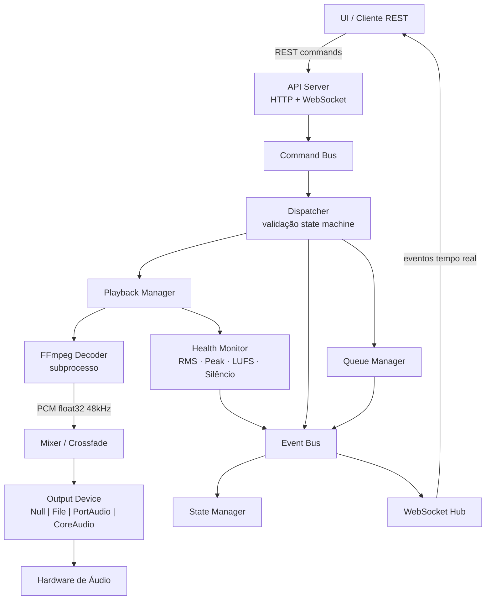
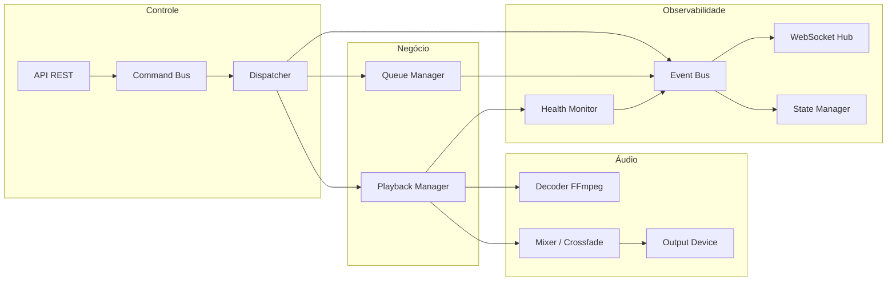

# Radio Playout Engine


Motor de automação de áudio para rádio FM/AM escrito em Go. Executa como processo independente e se comunica com qualquer UI via **REST** e **WebSocket** — sem acoplamento, sem banco de dados, sem dependência de interface gráfica.

No macOS, distribui como **`Playout.app`**: ícone na barra de menu, engine gerenciado como subprocesso, player HTML embutido em janela nativa WKWebView e setup automático na primeira execução.

---

## Índice

- [O que é e qual problema resolve](#o-que-é-e-qual-problema-resolve)
- [Features](#features)
- [Arquitetura técnica](#arquitetura-técnica)
- [Plataformas e drivers de saída](#plataformas-e-drivers-de-saída)
- [Ambiente de desenvolvimento](#ambiente-de-desenvolvimento)
- [Compilação](#compilação)
- [Configuração rápida](#configuração-rápida)
- [Uso básico](#uso-básico)
- [Scripts utilitários](#scripts-utilitários)
- [Documentação técnica](#documentação-técnica)
- [Makefile](#makefile)
- [Estrutura do projeto](#estrutura-do-projeto)

---

## O que é e qual problema resolve

Rádios locais precisam de um motor de automação confiável para manter o áudio no ar de forma contínua, com crossfade entre músicas, detecção de silêncio, modo de emergência e controle remoto em tempo real.

Sistemas comerciais como Zetta, RCS ou MusicMaster resolvem esse problema, mas têm custo elevado, são fechados e dependem de Windows. O **Radio Playout Engine** é uma alternativa open-source e multiplataforma que resolve exatamente isso:

- **Automação contínua** — fila de reprodução com crossfade automático, transições configuráveis e detecção de cue points
- **Resiliência** — detecção de silêncio, modo pânico com cama de emergência, recuperação automática de erros
- **Observabilidade profissional** — VU Meter EBU R128, LUFS integrado, peak hold, monitor de saúde em tempo real
- **Isolamento** — processo separado da UI; a interface gráfica nunca toca áudio; comunicação exclusiva via REST + WebSocket
- **Sem lock-in** — drivers de saída plugáveis (Null, File, PortAudio, CoreAudio); decodificação via FFmpeg; sem banco de dados

---

## Features

### 1. Fila de reprodução em memória

Gerenciamento completo de fila com suporte a múltiplos tipos de item:

- Tipos: `music`, `jingle`, `spot`, `id`, `vinheta`
- Operações: `enqueue` (adicionar ao final), `insert-next` (inserir após o item atual), `insert-after` (inserir após item específico), `clear` (limpar fila)
- Cada item carrega metadados operacionais: `title`, `artist`, `duration_ms`, `cue_in_ms`, `cue_out_ms`, transição e prioridade
- A fila emite eventos `QueueChanged` a cada mutação, permitindo que a UI reflita o estado em tempo real

### 2. Persistência da fila

A fila pode ser salva em disco e restaurada na inicialização, sobrevivendo a reinicializações e crashes:

- Snapshot em JSON no caminho configurado (padrão: `/tmp/playout-<engine-id>-queue.json`)
- `restore_on_start: true` — restaura o estado da fila ao iniciar
- `clear_on_stop: false` — mantém o snapshot em reinicializações normais; apaga apenas se configurado

### 3. Crossfade automático

Dois mecanismos de disparo, configuráveis de forma independente:

**Por tempo:** calcula o ponto de início com base em `cue_out_ms` do item atual e `default_crossfade_ms`. O próximo item começa a tocar em sobreposição com o final do atual.

**Por análise de energia (RMS dBFS):** monitora o nível do sinal em tempo real. Quando o RMS cai abaixo de `auto_crossfade_energy_threshold_dbfs` por `auto_crossfade_hold_frames` consecutivos, dentro da janela `[auto_crossfade_min_before_end_ms, auto_crossfade_max_before_end_ms]`, o crossfade é disparado imediatamente — ideal para músicas com fade-out gradual. O crossfade por tempo permanece como fallback.

### 4. Transições configuráveis por item

Cada item da fila pode definir sua própria transição de saída:

| Tipo | Comportamento |
|---|---|
| `CROSSFADE` | Sobreposição com o próximo item |
| `FADE_OUT` | Fade-out antes de silêncio; próximo item começa em silêncio |
| `CUT` | Corte seco ao atingir `cue_out_ms` |
| `HARD` | Corte imediato sem considerar `cue_out_ms` |

Se não informada, a transição global `default_crossfade_ms` é aplicada automaticamente em transições música → música.

### 5. Modo Assist

Permite que o operador assuma o controle manual sem interromper o áudio:

- Ativado via `POST /v1/playback/play` com sinalização de modo, ou pelo evento `EnterAssist`
- No modo Assist, o engine não avança automaticamente para o próximo item
- O operador pode usar `skip`, `insert-next` e `insert-after` livremente
- Retorno ao modo automático via `POST /v1/playback/resume` (comando `ReturnAuto`)
- Estado visível em `GET /v1/status` no campo `mode: "ASSIST"`

### 6. Modo Panic

Proteção de emergência para manter o áudio no ar em qualquer situação:

- **Prioridade máxima** — o comando `ENTER_PANIC` é aceito em qualquer estado exceto `STOPPING`
- **Cama de emergência** — arquivo de áudio configurado em `panic.bed_path` toca em loop enquanto o engine estiver em modo `PANIC`
- **Auto-panic** — quando `panic.auto_on_silence: true`, o engine entra em modo PANIC automaticamente após silêncio sustentado por `silence_duration_ms × 2` milissegundos
- **Saída manual** — operador escolhe via `POST /v1/panic/exit` se retorna para IDLE ou PLAYING
- Eventos `PanicEntered` e `PanicExited` são marcados como críticos e nunca descartados pelo WebSocket

### 7. Hot Buttons / Botoneira

Disparo instantâneo de áudio sobreposto ou em sequência ao conteúdo principal:

| Modo | Comportamento |
|---|---|
| `OVERLAY` | Toca sobre o item atual (ex: efeito sonoro, ID de rádio) |
| `INTERRUPT` | Interrompe o item atual e toca o botão (ex: flash de notícia) |
| `AFTER_CURRENT` | Enfileira como próximo item imediato |

Suporte a **ducking**: o volume do canal principal pode ser reduzido (`duck_gain_db`) durante a reprodução do hot button e restaurado automaticamente ao terminar. Eventos `DuckingStarted` e `DuckingEnded` são emitidos via WebSocket.

### 8. Monitor de saúde de áudio

Monitoramento contínuo do pipeline de áudio com publicação periódica de métricas:

- **RMS e Peak** em dBFS por janela configurável (`audio_health_interval_ms`)
- **Detecção de silêncio** — alerta `SilenceAlert` após silêncio contínuo acima de `silence_duration_ms`
- **Contador de underruns** — detecta falhas de escrita no dispositivo de saída
- **Percentual de buffer** — indica pressão no pipeline de áudio
- Publicado via evento `AudioHealthChanged` no WebSocket

### 9. VU Meter avançado (EBU R128)

Metragem profissional compatível com o padrão de broadcast EBU R128:

- **K-weighting** — filtro biquad de dois estágios com coeficientes fixos para 48kHz; simula a percepção humana do loudness
- **LUFS momentâneo** — janela deslizante de 400ms; indica o loudness percebido em tempo real
- **LUFS integrado** — acumulador lifetime; indica o loudness médio da sessão inteira
- **Peak Hold** — mantém o valor de pico por `peak_hold_ms` antes de decair
- **Separação L/R** — métricas independentes por canal para diagnóstico de desequilíbrio
- Publicado via evento `VUMeter` a cada `vu_meter_interval_ms` (padrão: 100ms)

### 10. Máquina de estados

O engine possui 8 estados e uma tabela estrita de comandos permitidos por estado:

```
STARTING → IDLE → PLAYING ⇄ PAUSED
                ↕
              ASSIST
                ↕
              PANIC  (prioridade máxima, qualquer estado)
                ↕
              ERROR  (reset → IDLE)
```

Comandos fora da tabela são rejeitados com evento `CommandRejected` e motivo legível. Isso garante que a API nunca coloca o engine em estado inconsistente.

### 11. API REST

Endpoints sob o prefixo `/v1` mais rotas de UI:

| Grupo | Endpoints |
|---|---|
| Health | `GET /v1/health`, `GET /v1/ready`, `GET /v1/status`, `GET /v1/build` |
| Info | `GET /v1/info` — PID, versão, start_time, IP local |
| Fila | `GET /v1/queue`, `POST /v1/queue/enqueue`, `POST /v1/queue/insert-next`, `POST /v1/queue/insert-after`, `POST /v1/queue/clear` |
| Playback | `POST /v1/playback/play`, `POST /v1/playback/pause`, `POST /v1/playback/resume`, `POST /v1/playback/stop`, `POST /v1/playback/skip` |
| Panic | `POST /v1/panic/enter`, `POST /v1/panic/exit` |
| Hot Buttons | `POST /v1/hotbuttons/trigger` |
| Admin | `POST /v1/admin/shutdown`, `GET /v1/metrics` |
| WebSocket | `GET /v1/events` |
| UI | `GET /status` — painel de status (SPA), `GET /player` — player de áudio embutido |

CORS configurável com lista de origens permitidas. Todo comando retorna um `command_id` para correlação com eventos.

### 12. WebSocket de eventos

Canal de eventos em tempo real para a UI via `GET /v1/events`:

- **25 tipos de evento** cobrem todo o ciclo de vida: estado, fila, progresso, saúde, crossfade, pânico, ducking, VU meter, erros
- **Prioridade de eventos** — críticos (`PanicEntered`, `CommandRejected`, `AlertRaised`, erros) nunca são descartados; eventos de baixa prioridade (`ProgressChanged`, `AudioHealthChanged`) podem ser descartados sob carga para não bloquear o pipeline
- **Snapshot inicial** — novos clientes recebem `StateSnapshot` com o estado completo ao conectar

### 13. Drivers de saída plugáveis

A interface `OutputDevice` desacopla completamente o playback do hardware:

| Driver | Uso | Build Tag | Dependência |
|---|---|---|---|
| `NullOutput` | Testes sem hardware | — | nenhuma |
| `FileOutput` | Gravação PCM/WAV | — | nenhuma |
| `PortAudio` | Multiplataforma (macOS/Linux/Windows) | `portaudio` | libportaudio |
| `CoreAudio` | Nativo macOS via AudioQueue | `coreaudio` | nenhuma (frameworks do sistema) |

O driver é selecionável em runtime via `audio.output.driver` no YAML, sem recompilar o código de playback.

### 14. Decodificador FFmpeg

Decodificação de qualquer formato suportado pelo FFmpeg via subprocesso isolado:

- Formato interno: PCM float32 little-endian, 48000 Hz, 2 canais (estéreo interleaved)
- Subprocesso filho: se o engine morrer, o processo FFmpeg é terminado automaticamente pelo SO
- Stderr do FFmpeg capturado e emitido via log estruturado (slog) para rastreabilidade
- Suporta MP3, AAC, WAV, FLAC, OGG e todos os formatos suportados pelo FFmpeg instalado

### 15. Lock de instância

Previne que dois processos com o mesmo `engine.id` sejam iniciados simultaneamente:

- Em Unix: arquivo de lock em `/tmp/playout-<engine-id>.lock`
- Em Windows: mutex nomeado pelo sistema operacional
- Configurável via `engine.instance_lock: true/false`

### 16. Hora Certa

Suporte nativo a anúncio de hora certa com arquivos de áudio por hora e minuto:

- Ativa quando um item do tipo `HORA_CERTA` é desenfileirado
- Reproduce em sequência: arquivo de hora (`HRS{HH}.mp3`) + arquivo de minuto (`MIN{MM}.mp3`)
- Quando o minuto é `00` e `MIN00.mp3` não existe, apenas o arquivo de hora é tocado
- `gain_db` configurável para ajuste de volume independente
- Diretórios configuráveis via `hora_certa.hours_dir` e `hora_certa.minutes_dir`

### 17. Bundle macOS (Playout.app)

Aplicativo nativo para macOS com systray e interface gráfica embutida:

- **Ícone na barra de menu** — play-button verde (engine online) ou vermelho (offline)
- **Menu** — Iniciar / Parar / Reiniciar Engine, Status, Player, Sair
- **Player** — abre o player HTML em janela nativa WKWebView (sem browser externo)
- **Status** — painel de diagnóstico SPA com atualização automática a cada 5s e detecção offline
- **First-run** — cria `~/RadioFlow/` com subdiretórios de mídia e `playout-engine.yaml` na primeira abertura
- **Logs** — stdout/stderr do subprocesso redirecionados para `~/RadioFlow/logs/engine.log`
- **PATH expandido** — `/opt/homebrew/bin`, `/usr/local/bin` e `/opt/local/bin` adicionados automaticamente para encontrar `ffmpeg`

---

## Arquitetura técnica

### Fluxo de controle



### Camadas do sistema



### Regra fundamental

> A API nunca acessa o mixer ou o dispositivo de saída diretamente.
> Todo comando passa pelo Command Bus → Dispatcher → handlers de negócio.
> Todo estado visível vem do State Manager via `GET /v1/status` ou eventos WebSocket.

---

## Plataformas e drivers de saída

| Sistema Operacional | Driver recomendado | Build Tag | Dependência do sistema |
|---|---|---|---|
| macOS | CoreAudio (nativo) | `coreaudio` | nenhuma — usa AudioToolbox do sistema |
| macOS | PortAudio | `portaudio` | `brew install portaudio` |
| Linux | PortAudio | `portaudio` | `apt install libportaudio2-dev` |
| Windows | PortAudio | `portaudio` | binário pré-compilado ou vcpkg |
| Qualquer (testes) | Null / File | — | nenhuma |

### Instalação do FFmpeg por plataforma

**macOS:**
```bash
brew install ffmpeg
```

**Linux (Ubuntu/Debian):**
```bash
sudo apt update && sudo apt install ffmpeg
```

**Windows:**
Baixar em [ffmpeg.org](https://ffmpeg.org/download.html) e adicionar ao `PATH`.

---

## Ambiente de desenvolvimento

### Pré-requisitos

| Ferramenta | Versão mínima | Instalação |
|---|---|---|
| Go | 1.24+ | [go.dev/dl](https://go.dev/dl/) |
| ffmpeg | 4.0+ | ver seção acima |
| ffprobe | 4.0+ | incluído no pacote ffmpeg |
| Git | qualquer | nativo ou [git-scm.com](https://git-scm.com) |
| PortAudio | 19+ | apenas se usar driver `portaudio` |

### Clonar e verificar

```bash
git clone https://github.com/Waelson/radio-playout-engine.git
cd radio-playout-engine

# Verificar dependências Go
go mod download
go mod verify

# Verificar que ffmpeg está disponível
ffmpeg -version
ffprobe -version
```

### Rodar os testes

```bash
# Testes unitários (sem CGO, sem dispositivo de áudio)
go test ./...

# Com detector de corrida
go test -race ./...

# Análise estática
go vet ./...
```

---

## Compilação

### Opção 1 — Sem driver de áudio real (testes e CI)

```bash
make build
# ou
CGO_ENABLED=0 go build -ldflags "-X main.Version=0.1.0" -o playout-engine ./cmd/playout-engine
```

Suporta `driver: "null"` e `driver: "file"`. Não requer CGO nem bibliotecas externas.

### Opção 2 — PortAudio (macOS, Linux, Windows)

```bash
make build-portaudio
# ou
go build -tags portaudio -ldflags "-X main.Version=0.1.0" -o playout-engine ./cmd/playout-engine
```

Requer libportaudio instalada no sistema.

### Opção 3 — CoreAudio nativo (macOS)

```bash
make build-coreaudio
# ou
go build -tags coreaudio -ldflags "-X main.Version=0.1.0" -o playout-engine ./cmd/playout-engine
```

Usa `AudioToolbox` e `CoreFoundation` do sistema via CGO. Sem dependências externas. Menor latência que PortAudio em macOS.

### Opção 4 — Bundle macOS (.app)

Gera o `dist/Playout.app` pronto para uso, com systray, webview e ícone de aplicação:

```bash
make dist-mac
```

Requer Xcode Command Line Tools (`xcode-select --install`) e `ffmpeg` instalado via Homebrew.

O app:
- Aparece na barra de menu (sem ícone no Dock)
- Inicia a engine automaticamente ao abrir
- Ícone **verde** (online) / **vermelho** (offline) indica o estado da engine
- Menu **Player** abre o player HTML em janela nativa WKWebView
- Menu **Status** abre o painel de diagnóstico no browser
- Cria `~/RadioFlow/` com estrutura de diretórios e config YAML na primeira execução

---

## Configuração rápida

O arquivo de configuração é `playout-engine.yaml`. A precedência é:

```
flags CLI  >  variáveis de ambiente  >  playout-engine.yaml  >  padrões internos
```

### Principais seções

| Seção | Campos importantes |
|---|---|
| `engine` | `id`, `instance_lock` |
| `api` | `host`, `port`, `cors.allowed_origins` |
| `audio` | `sample_rate`, `channels`, `output.driver`, `output.device_id`, `allow_null_output` |
| `playback` | `default_crossfade_ms`, `auto_crossfade_enabled`, `auto_crossfade_energy_threshold_dbfs` |
| `health` | `silence_threshold_dbfs`, `silence_duration_ms`, `vu_meter_enabled` |
| `panic` | `enabled`, `bed_path`, `auto_on_silence` |
| `queue.persistence` | `enabled`, `path`, `restore_on_start`, `clear_on_stop` |
| `logging` | `level` (debug/info/warn/error), `format` (json/text) |
| `hora_certa` | `hours_dir`, `minutes_dir`, `hour_pattern`, `minute_pattern`, `gain_db` |

### Inicializar o engine

```bash
./playout-engine --config playout-engine.yaml
```

Verificar que está no ar:

```bash
curl http://127.0.0.1:8080/v1/health
# {"status":"ok"}
```

---

## Uso básico

### 1. Verificar status

```bash
curl http://127.0.0.1:8080/v1/status
```

### 2. Enfileirar uma música

```bash
# Obter duração e cue points com o script utilitário
CUES=$(./scripts/analyze-cues.sh /library/track01.mp3 --json)
DURATION=$(echo "$CUES" | python3 -c "import sys,json; print(json.load(sys.stdin)['duration_ms'])")
CUE_IN=$(echo  "$CUES" | python3 -c "import sys,json; print(json.load(sys.stdin)['cue_in_ms'])")
CUE_OUT=$(echo "$CUES" | python3 -c "import sys,json; print(json.load(sys.stdin)['cue_out_ms'])")

curl -X POST http://127.0.0.1:8080/v1/queue/enqueue \
  -H "Content-Type: application/json" \
  -d "{
    \"path\": \"/library/track01.mp3\",
    \"title\": \"Track 01\",
    \"artist\": \"Artista\",
    \"type\": \"music\",
    \"duration_ms\": $DURATION,
    \"cue_in_ms\": $CUE_IN,
    \"cue_out_ms\": $CUE_OUT
  }"
```

### 3. Iniciar reprodução

```bash
curl -X POST http://127.0.0.1:8080/v1/playback/play
```

### 4. Escutar eventos via WebSocket

```bash
# Requer wscat: npm install -g wscat
wscat -c ws://127.0.0.1:8080/v1/events
```

### 5. Skip e Stop

```bash
curl -X POST http://127.0.0.1:8080/v1/playback/skip
curl -X POST http://127.0.0.1:8080/v1/playback/stop
```

### 6. Modo Panic

```bash
# Entrar em modo pânico
curl -X POST http://127.0.0.1:8080/v1/panic/enter \
  -H "Content-Type: application/json" \
  -d '{"reason": "operador acionou emergência"}'

# Sair do modo pânico
curl -X POST http://127.0.0.1:8080/v1/panic/exit
```

---

## Scripts utilitários

A pasta `scripts/` contém ferramentas para preparar arquivos de áudio antes de enfileirá-los.
Consulte [`scripts/scripts.md`](scripts/scripts.md) para documentação completa.

### audio-duration.sh

Retorna a duração de um arquivo em milissegundos — valor necessário para o campo `duration_ms` do enqueue:

```bash
./scripts/audio-duration.sh /library/track01.mp3
# 214500
```

### analyze-cues.sh

Detecta automaticamente `cue_in_ms` e `cue_out_ms` eliminando silêncios no início e fim da faixa:

```bash
./scripts/analyze-cues.sh /library/track01.mp3 --json
# {
#   "file": "/library/track01.mp3",
#   "duration_ms": 214500,
#   "cue_in_ms": 1150,
#   "cue_out_ms": 211300
# }
```

Ambos os scripts requerem `ffmpeg` e `ffprobe` instalados e disponíveis no PATH.

---

## Documentação técnica

A especificação completa do sistema está em [`docs/specs/`](docs/specs/):

| Documento | Descrição |
|---|---|
| [00-overview.md](docs/specs/00-overview.md) | Visão geral do produto e escopo |
| [01-architecture.md](docs/specs/01-architecture.md) | Arquitetura de alto nível e componentes |
| [02-process-model.md](docs/specs/02-process-model.md) | Modelo de processo, isolamento e shutdown |
| [03-api-rest.md](docs/specs/03-api-rest.md) | Contrato completo da API REST |
| [04-events-websocket.md](docs/specs/04-events-websocket.md) | Schema dos eventos WebSocket |
| [05-state-machine.md](docs/specs/05-state-machine.md) | Máquina de estados e transições |
| [06-audio-pipeline.md](docs/specs/06-audio-pipeline.md) | Pipeline de áudio interno |
| [07-queue-playback.md](docs/specs/07-queue-playback.md) | Fila e execução de itens |
| [08-crossfade-ducking-hotbuttons.md](docs/specs/08-crossfade-ducking-hotbuttons.md) | Crossfade, ducking e botoneira |
| [09-device-abstraction.md](docs/specs/09-device-abstraction.md) | Interface de dispositivos de saída |
| [10-resilience-error-handling.md](docs/specs/10-resilience-error-handling.md) | Resiliência e tratamento de erros |
| [11-observability.md](docs/specs/11-observability.md) | Logs, métricas e diagnóstico |
| [12-configuration.md](docs/specs/12-configuration.md) | Sistema de configuração |
| [13-platform-support.md](docs/specs/13-platform-support.md) | Suporte macOS, Linux e Windows |
| [14-testing-strategy.md](docs/specs/14-testing-strategy.md) | Estratégia de testes |
| [15-roadmap.md](docs/specs/15-roadmap.md) | Roadmap incremental |
| [16-security.md](docs/specs/16-security.md) | Segurança e restrições de acesso |
| [99-decisions.md](docs/specs/99-decisions.md) | Registros de decisão arquitetural (ADR) |

---

## Makefile

| Target | Descrição |
|---|---|
| `make build` | Compila sem CGO (drivers Null e File apenas) |
| `make build-portaudio` | Compila com suporte a PortAudio |
| `make build-coreaudio` | Compila com CoreAudio nativo (macOS, requer CGO) |
| `make dist-mac` | Gera `dist/Playout.app` bundle para macOS |
| `make test` | Roda todos os testes unitários (sem CGO) |
| `make test-race` | Roda testes com detector de corrida |
| `make vet` | Executa `go vet` |
| `make run` | Compila (pure Go) e inicia o engine |
| `make run-portaudio` | Compila com PortAudio e inicia o engine |
| `make clean` | Remove o binário compilado |
| `make help` | Lista todos os targets disponíveis |

---

## Estrutura do projeto

```
cmd/playout-engine/
├── main.go                  — ponto de entrada; roteamento entre CLI, UI e webview
├── player_data.go           — embute assets/player.html no binário (build !cli)
├── player_data_cli.go       — stub vazio para builds headless (build cli)
├── assets/
│   ├── player.html          — interface do operador (single-page app)
│   └── icon.png             — ícone do .app bundle (1024×1024)
├── engine/                  — gerenciamento do processo filho + first-run setup
├── output/                  — fábrica do driver de saída de áudio (build tags)
├── systray/                 — UI do systray, ícones de status, stub CLI
└── webview/                 — janela nativa WKWebView, zoom macOS, stub CLI

internal/
├── api/                     — HTTP server, handlers REST, handler do /status e /player
├── audio/
│   ├── decoder/             — FFmpegDecoder (subprocesso, PCM float32)
│   ├── mixer/               — crossfade, gain, duck
│   └── output/              — interface OutputDevice + NullOutput, FileOutput, CoreAudio, PortAudio
├── commands/                — tipos de comandos e command bus
├── config/                  — carregamento de config (YAML + env + flags)
├── dispatcher/              — wiring entre command bus e handlers
├── events/                  — tipos de eventos e event bus
├── health/                  — monitor de silêncio, VU meter, RMS/peak
├── horacerta/               — resolução de arquivos de hora/minuto
├── logging/                 — logger estruturado (slog)
├── metrics/                 — contadores de eventos
├── platform/                — instance lock (Unix flock / Windows mutex)
├── playback/                — loop de reprodução, crossfade, modo panic
├── queue/                   — fila em memória com persistência opcional
└── state/                   — máquina de estados (IDLE, PLAYING, PAUSED…)
```
