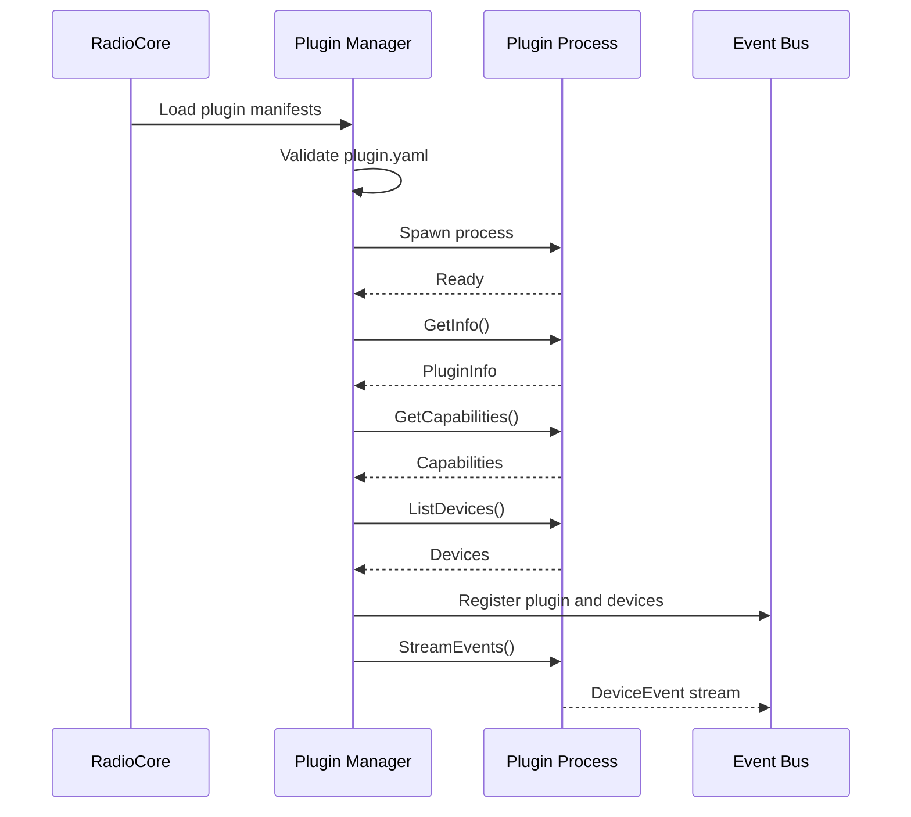
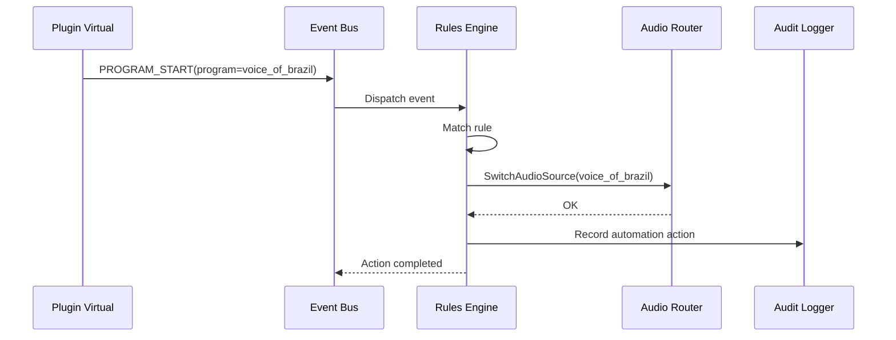
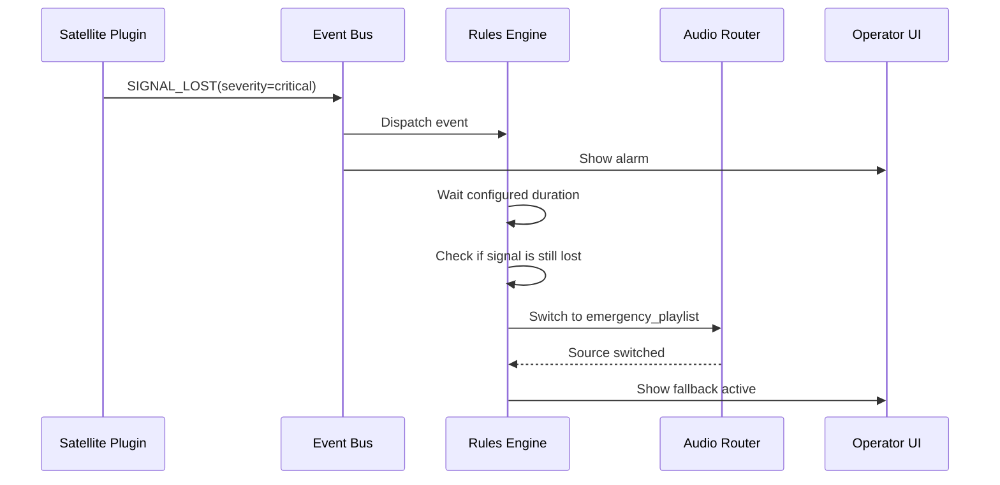

# RadioFlow Broadcast Plugin Platform — Especificação Técnica

**Produto:** RadioFlow Player / RadioCore Playout  
**Documento:** Especificação da plataforma de plugins para integração com hardware e protocolos de broadcast  
**Status:** Draft inicial para prova de conceito  
**Versão:** 0.1.0  
**Idioma:** pt-BR  

---

## 1. Resumo executivo

O RadioCore deve evoluir de um playout focado em reprodução de áudio para uma **plataforma de automação broadcast integrável**. Em ambientes profissionais de rádio, o playout raramente opera isolado. Ele precisa interagir com mesas digitais, interfaces GPIO, codecs IP, receptores de satélite, processadores de áudio, encoders RDS, transmissores, detectores de silêncio, matrizes de áudio, sistemas de streaming e serviços externos.

O objetivo desta especificação é definir uma arquitetura de plugins que permita ao RadioCore integrar-se com esse ecossistema sem acoplar o núcleo do playout a fabricantes, protocolos ou equipamentos específicos.

A proposta central é:

```text
RadioCore = programação, áudio, scheduler, regras, UI e estado operacional
Plugins        = integração com dispositivos, protocolos, eventos e telemetria
```

O plugin deve ser executado preferencialmente como **processo externo**, comunicando-se com o core por **gRPC**, **TCP**, **WebSocket** ou outro transporte padronizado. Essa abordagem reduz acoplamento, melhora isolamento, permite reinício independente e abre espaço para plugins escritos em outras linguagens no futuro.

---

## 2. Necessidade de mercado

### 2.1 Cenário das rádios

Rádios profissionais possuem uma cadeia técnica composta por múltiplos equipamentos:

```text
Fontes de áudio
    ├── Playlist local
    ├── Microfone
    ├── Mesa de som
    ├── Codec IP
    ├── Receptor de satélite
    ├── Stream externo
    ├── Rede nacional
    └── Voz do Brasil

Automação
    ├── Scheduler
    ├── Playout
    ├── Break comercial
    ├── Jingles/vinhetas
    ├── Controle de eventos
    └── Logging

Broadcast chain
    ├── Processador de áudio
    ├── Encoder RDS
    ├── Link STL
    ├── Transmissor FM/AM
    └── Monitoramento técnico
```

Um playout profissional precisa operar nesse ambiente heterogêneo. O problema é que cada equipamento pode expor integração de forma diferente:

```text
GPIO
Serial RS-232/RS-485
TCP socket
UDP
HTTP
SNMP
RTP
SRT
Icecast/Shoutcast
Dante
AES67
MPEG-TS
APIs proprietárias
```

Sem uma camada de plugins, o core do playout tende a acumular lógica específica de hardware. Isso dificulta manutenção, limita o produto a poucos equipamentos e torna cada nova integração cara e arriscada.

### 2.2 Problemas reais que a plataforma resolve

A plataforma de plugins deve resolver os seguintes problemas:

1. **Integração com equipamentos heterogêneos**  
   Permitir que RadioCore converse com diferentes fabricantes sem alterar o core.

2. **Automação baseada em eventos externos**  
   Capturar eventos como `START_NETWORK`, `STOP_NETWORK`, `SILENCE_DETECTED`, `SIGNAL_LOST`, `GPIO_RISING_EDGE`, `TRANSMITTER_ALARM`.

3. **Monitoramento operacional**  
   Exibir status de dispositivos críticos: receptor, codec, processador, transmissor, rede, streaming, GPIO e entrada de áudio.

4. **Contingência automática**  
   Trocar fonte de áudio, iniciar playlist de emergência ou notificar operador quando houver falha técnica.

5. **Extensibilidade comercial**  
   Permitir que integrações com fabricantes sejam adicionadas como plugins, sem recompilar ou redistribuir o playout inteiro.

6. **Redução de custo de adoção**  
   Pequenas rádios podem começar com plugins simples, como captura de stream, detector de silêncio e GPIO USB. Rádios maiores podem adicionar codecs IP, SNMP, RDS e integração com mesas digitais.

7. **Separação entre domínio de áudio e domínio de dispositivo**  
   O core cuida da lógica broadcast; plugins cuidam dos detalhes de protocolo, hardware e transporte.

---

## 3. Objetivos

### 3.1 Objetivos funcionais

A plataforma deve permitir:

- registrar plugins instalados;
- iniciar e parar plugins;
- consultar status de plugins;
- receber eventos em tempo real;
- executar comandos em dispositivos;
- mapear eventos técnicos para ações do playout;
- coletar métricas;
- expor logs técnicos;
- configurar plugins via UI ou arquivo;
- isolar falhas de plugin sem derrubar o playout;
- permitir plugins simulados para desenvolvimento e demonstração.

### 3.2 Objetivos não funcionais

A plataforma deve priorizar:

- confiabilidade;
- baixo acoplamento;
- compatibilidade entre versões;
- execução 24/7;
- observabilidade;
- segurança;
- facilidade de diagnóstico;
- tolerância a falhas;
- reinício independente;
- simplicidade operacional.

---

## 4. Não objetivos

Nesta primeira fase, a plataforma não precisa:

- implementar todos os protocolos broadcast existentes;
- suportar hot reload complexo de plugins nativos `.so`;
- garantir compatibilidade com qualquer fabricante sem plugin específico;
- processar áudio DSP avançado dentro dos plugins;
- substituir equipamentos profissionais de broadcast;
- implementar marketplace público de plugins;
- executar plugins de terceiros sem validação ou assinatura.

---

## 5. Conceitos principais

### 5.1 Core

O **RadioCore** é o núcleo do playout.

Responsabilidades:

- scheduler;
- execução de playlist;
- player de áudio;
- mixer lógico;
- regras de automação;
- UI principal;
- persistência;
- logs;
- auditoria;
- API interna;
- roteamento de eventos;
- controle de estado da programação.

O core não deve conhecer detalhes específicos de fabricantes.

### 5.2 Plugin

Um **plugin** é um processo externo que implementa um contrato padronizado e expõe capacidades ao core.

Exemplos:

```text
radiocore-plugin-virtual-device
radiocore-plugin-gpio-usb
radiocore-plugin-snmp-monitor
radiocore-plugin-icecast-input
radiocore-plugin-rds-encoder
radiocore-plugin-telos-codec
radiocore-plugin-satellite-receiver
```

### 5.3 Device

Um **Device** representa um equipamento físico ou virtual.

Exemplos:

```text
Codec IP
Receptor de satélite
Interface GPIO
Encoder RDS
Transmissor FM
Processador de áudio
Mesa digital
Stream Icecast
Detector de silêncio
Dispositivo virtual de teste
```

Um plugin pode gerenciar um ou mais devices.

### 5.4 Capability

Uma **capability** descreve o que um plugin consegue oferecer.

Exemplos:

```text
audio_input
audio_output
events
commands
status
metrics
gpio_input
gpio_output
snmp
rds
silence_detection
stream_receive
stream_send
```

O core deve descobrir capabilities dinamicamente.

---

## 6. Arquitetura geral

### 6.1 Visão macro

```text
+------------------------------------------------------------------+
|                         RadioFlow UI                             |
|------------------------------------------------------------------|
|  Scheduler | Playlist | Devices | Events | Logs | Monitoring     |
+------------------------------------------------------------------+
                                |
                                v
+------------------------------------------------------------------+
|                            RadioCore                             |
|------------------------------------------------------------------|
|  Plugin Manager                                                  |
|  Event Bus                                                       |
|  Device Registry                                                 |
|  Command Router                                                  |
|  Audio Router                                                    |
|  Rules Engine                                                    |
|  Observability                                                   |
|  Persistence                                                     |
+------------------------------------------------------------------+
          |                |                 |                |
          | gRPC/TCP       | gRPC/TCP        | gRPC/TCP       | gRPC/TCP
          v                v                 v                v
+----------------+ +----------------+ +----------------+ +----------------+
| GPIO Plugin    | | SNMP Plugin    | | Codec Plugin   | | RDS Plugin     |
|----------------| |----------------| |----------------| |----------------|
| USB/Ethernet   | | Transmitter    | | RTP/SRT/IP     | | Encoder RDS    |
| GPIO Adapter   | | Processor      | | Codec Device   | | Serial/TCP     |
+----------------+ +----------------+ +----------------+ +----------------+
```

### 6.2 Arquitetura com fonte externa: Voz do Brasil / rede nacional

```text
                      +---------------------------+
                      | Fonte externa             |
                      | Rede nacional / EBC / IP  |
                      +-------------+-------------+
                                    |
                                    | áudio IP / satélite / line-in
                                    v
+-------------------+     +------------------------+
| Receptor/Decoder  |---->| Interface de áudio     |
| Satélite/IP       |     | USB/AES67/Dante/Line   |
+---------+---------+     +-----------+------------+
          |                           |
          | evento GPIO/SNMP/API      | áudio PCM/stream
          v                           v
+-------------------+       +-----------------------+
| Device Plugin     |------>| RadioCore             |
| Events/Status     |       | Audio Router          |
+-------------------+       | Scheduler             |
                            | Rules Engine          |
                            +-----------------------+
```

### 6.3 Arquitetura orientada a eventos

```text
+----------------+
| Device Plugin  |
+-------+--------+
        |
        | DeviceEvent
        v
+----------------+
| Event Bus      |
+-------+--------+
        |
        +-------------------+---------------------+
        |                   |                     |
        v                   v                     v
+---------------+   +----------------+    +----------------+
| Rules Engine  |   | UI Monitoring  |    | Audit Logger   |
+-------+-------+   +----------------+    +----------------+
        |
        | Action
        v
+----------------+
| Playout Core   |
+----------------+
```

---

## 7. Escolha técnica: processo externo em vez de plugin nativo Go

### 7.1 Por que não usar `plugin` nativo do Go como padrão

O Go possui suporte a plugins nativos via `buildmode=plugin`, mas essa abordagem possui limitações relevantes para um produto broadcast:

- depende fortemente da versão do Go;
- exige compatibilidade rígida entre core e plugin;
- é mais difícil de distribuir em múltiplas plataformas;
- não é ideal para Windows;
- não permite unload simples;
- uma falha grave no plugin pode afetar o processo principal;
- dificulta isolamento e reinício independente.

### 7.2 Modelo recomendado

Usar **plugins como processos externos**.

```text
radiocore
    ├── inicia plugin A
    ├── inicia plugin B
    ├── monitora heartbeat
    ├── reinicia plugin em falha
    └── comunica via gRPC/TCP/WebSocket
```

Vantagens:

- isolamento;
- compatibilidade melhor;
- restart independente;
- plugins em outras linguagens no futuro;
- menor risco para o áudio principal;
- melhor observabilidade;
- deploy mais simples;
- possibilidade de sandbox.

---

## 8. Componentes do core

### 8.1 Plugin Manager

Responsável por:

- ler manifests;
- validar plugins;
- iniciar processos;
- negociar protocolo;
- acompanhar health;
- reiniciar plugins quando necessário;
- registrar capabilities;
- encerrar plugins com segurança.

### 8.2 Device Registry

Mantém a lista de dispositivos expostos pelos plugins.

Exemplo:

```json
{
  "device_id": "satellite_receiver_1",
  "plugin_id": "satellite-plugin",
  "name": "Receptor Satélite Principal",
  "type": "satellite_receiver",
  "capabilities": ["status", "events", "metrics", "commands"]
}
```

### 8.3 Event Bus

Recebe eventos dos plugins e distribui para:

- Rules Engine;
- UI;
- logs;
- automações;
- alertas;
- integrações externas.

### 8.4 Command Router

Recebe comandos do core/UI e encaminha ao plugin correto.

Exemplos:

```text
switch_input
set_rds_text
reset_alarm
enable_relay
disable_relay
start_stream
stop_stream
change_profile
```

### 8.5 Rules Engine

Traduz eventos técnicos em ações do playout.

Exemplo:

```yaml
when:
  event_type: SIGNAL_LOST
  device_id: satellite_receiver_1
for: 5s
then:
  - action: switch_audio_source
    source: emergency_playlist
  - action: notify_operator
    severity: critical
```

### 8.6 Audio Router

Gerencia fontes de áudio.

Pode receber áudio de:

- arquivos;
- interface de áudio;
- stream IP;
- dispositivo virtual;
- plugin que expõe audio stream;
- BlackHole/Loopback;
- line-in.

---

## 9. Contrato de plugin

### 9.1 Princípio

Todo plugin deve implementar um contrato mínimo:

```text
GetInfo()
GetCapabilities()
ListDevices()
GetStatus()
StreamEvents()
ExecuteCommand()
Shutdown()
```

Capabilities adicionais podem ser implementadas conforme o tipo de plugin.

### 9.2 Interface conceitual em Go

```go
type BroadcastPlugin interface {
    GetInfo(ctx context.Context) (PluginInfo, error)
    GetCapabilities(ctx context.Context) ([]Capability, error)
    ListDevices(ctx context.Context) ([]Device, error)
    GetStatus(ctx context.Context, deviceID string) (DeviceStatus, error)
    StreamEvents(ctx context.Context) (<-chan DeviceEvent, error)
    ExecuteCommand(ctx context.Context, cmd Command) (CommandResult, error)
    Shutdown(ctx context.Context) error
}
```

### 9.3 Contrato gRPC sugerido

```proto
syntax = "proto3";

package radiocore.plugins.v1;

service BroadcastPluginService {
  rpc GetInfo(GetInfoRequest) returns (GetInfoResponse);
  rpc GetCapabilities(GetCapabilitiesRequest) returns (GetCapabilitiesResponse);
  rpc ListDevices(ListDevicesRequest) returns (ListDevicesResponse);
  rpc GetStatus(GetStatusRequest) returns (GetStatusResponse);
  rpc StreamEvents(StreamEventsRequest) returns (stream DeviceEvent);
  rpc ExecuteCommand(ExecuteCommandRequest) returns (ExecuteCommandResponse);
  rpc Shutdown(ShutdownRequest) returns (ShutdownResponse);
}

message GetInfoRequest {}

message GetInfoResponse {
  string plugin_id = 1;
  string name = 2;
  string version = 3;
  string vendor = 4;
  string protocol_version = 5;
  repeated string supported_platforms = 6;
}

message GetCapabilitiesRequest {}

message GetCapabilitiesResponse {
  repeated Capability capabilities = 1;
}

message Capability {
  string name = 1;
  string version = 2;
  bool required = 3;
}

message ListDevicesRequest {}

message ListDevicesResponse {
  repeated Device devices = 1;
}

message Device {
  string device_id = 1;
  string name = 2;
  string type = 3;
  repeated string capabilities = 4;
  map<string, string> metadata = 5;
}

message GetStatusRequest {
  string device_id = 1;
}

message GetStatusResponse {
  DeviceStatus status = 1;
}

message DeviceStatus {
  string device_id = 1;
  string state = 2;
  string health = 3;
  int64 timestamp_unix_ms = 4;
  repeated Metric metrics = 5;
  repeated Alarm alarms = 6;
  map<string, string> attributes = 7;
}

message Metric {
  string name = 1;
  double value = 2;
  string unit = 3;
}

message Alarm {
  string code = 1;
  string severity = 2;
  string message = 3;
  bool active = 4;
}

message StreamEventsRequest {}

message DeviceEvent {
  string event_id = 1;
  string plugin_id = 2;
  string device_id = 3;
  string type = 4;
  string severity = 5;
  int64 timestamp_unix_ms = 6;
  map<string, string> attributes = 7;
}

message ExecuteCommandRequest {
  string command_id = 1;
  string device_id = 2;
  string command = 3;
  map<string, string> parameters = 4;
}

message ExecuteCommandResponse {
  string command_id = 1;
  bool success = 2;
  string message = 3;
  map<string, string> result = 4;
}

message ShutdownRequest {}

message ShutdownResponse {
  bool accepted = 1;
}
```

---

## 10. Manifest do plugin

Cada plugin deve possuir um arquivo `plugin.yaml`.

### 10.1 Exemplo

```yaml
id: radiocore-plugin-virtual-device
name: Virtual Broadcast Device
version: 0.1.0
vendor: RadioCore
description: Plugin virtual para simular equipamentos broadcast.
runtime:
  type: process
  command: ./radiocore-plugin-virtual-device
  args:
    - --config
    - ./config.yaml
protocol:
  type: grpc
  host: 127.0.0.1
  port: 0
  version: v1
capabilities:
  - status
  - events
  - commands
  - metrics
  - gpio_input
  - gpio_output
platforms:
  - darwin-arm64
  - darwin-amd64
  - linux-amd64
  - windows-amd64
permissions:
  network: false
  serial: false
  filesystem: read_config_only
healthcheck:
  interval_ms: 5000
  timeout_ms: 1500
  failure_threshold: 3
restart_policy:
  enabled: true
  max_restarts: 5
  backoff_ms: 2000
```

### 10.2 Campos obrigatórios

```text
id
name
version
runtime.type
runtime.command
protocol.type
capabilities
```

### 10.3 Campos recomendados

```text
vendor
description
permissions
healthcheck
restart_policy
platforms
config_schema
```

---

## 11. Lifecycle do plugin

### 11.1 Estados

```text
DISCOVERED
VALIDATED
STARTING
RUNNING
DEGRADED
FAILED
STOPPING
STOPPED
DISABLED
```

### 11.2 Máquina de estados

```text
DISCOVERED
    |
    v
VALIDATED
    |
    v
STARTING
    |
    v
RUNNING -----> DEGRADED
    |              |
    |              v
    |-----------> FAILED
                   |
                   v
                STARTING

RUNNING
    |
    v
STOPPING
    |
    v
STOPPED
```

### 11.3 Sequência de boot

```text
   RadioCore                  Plugin Process
      |                               |
      | read plugin.yaml              |
      | validate manifest             |
      | spawn process                 |
      |------------------------------>|
      |                               | start gRPC server
      | wait ready                    |
      |------------------------------>|
      | GetInfo                       |
      |<------------------------------|
      | GetCapabilities               |
      |<------------------------------|
      | ListDevices                   |
      |<------------------------------|
      | register devices              |
      | subscribe StreamEvents        |
      |------------------------------>|
      |                               | stream events
      |<------------------------------|
```

### 11.4 Diagrama de sequência: inicialização



---

## 12. Modelo de eventos

### 12.1 Evento canônico

```json
{
  "event_id": "evt_01HX...",
  "plugin_id": "radiocore-plugin-gpio",
  "device_id": "gpio_interface_1",
  "type": "GPIO_RISING_EDGE",
  "severity": "info",
  "timestamp_unix_ms": 1730000000000,
  "attributes": {
    "input": "1",
    "mapped_action": "START_NETWORK"
  }
}
```

### 12.2 Tipos de eventos recomendados

```text
DEVICE_ONLINE
DEVICE_OFFLINE
DEVICE_DEGRADED
SIGNAL_LOCKED
SIGNAL_LOST
AUDIO_PRESENT
AUDIO_LOST
SILENCE_DETECTED
SILENCE_CLEARED
GPIO_RISING_EDGE
GPIO_FALLING_EDGE
GPIO_PULSE
PROGRAM_START
PROGRAM_END
BREAK_START
BREAK_END
NETWORK_START
NETWORK_END
RDS_TEXT_SENT
STREAM_CONNECTED
STREAM_DISCONNECTED
COMMAND_ACK
COMMAND_FAILED
TRANSMITTER_ALARM
TEMPERATURE_ALARM
POWER_REDUCED
```

### 12.3 Severidade

```text
debug
info
warning
error
critical
```

### 12.4 Regras de evento

Todo evento deve:

- possuir `event_id`;
- possuir timestamp;
- identificar plugin;
- identificar device, quando aplicável;
- possuir tipo canônico;
- usar attributes para dados específicos;
- ser idempotente quando possível;
- ser logável e auditável.

---

## 13. Modelo de comandos

### 13.1 Comando canônico

```json
{
  "command_id": "cmd_01HX...",
  "device_id": "rds_encoder_1",
  "command": "set_rds_text",
  "parameters": {
    "ps": "RADIOXYZ",
    "rt": "Agora: Artista - Música"
  }
}
```

### 13.2 Exemplos de comandos

```text
set_rds_text
clear_rds_text
enable_gpio_output
disable_gpio_output
pulse_gpio_output
reset_device
switch_profile
connect_stream
disconnect_stream
set_stream_url
ack_alarm
set_audio_route
```

### 13.3 Resultado

```json
{
  "command_id": "cmd_01HX...",
  "success": true,
  "message": "RDS text updated",
  "result": {
    "latency_ms": "34"
  }
}
```

---

## 14. Áudio e plugins

### 14.1 Princípio

Nem todo plugin precisa transportar áudio. Em muitos casos, o plugin apenas expõe eventos e status.

Exemplo:

```text
Receptor de satélite
    ├── áudio sai por XLR/AES/USB para interface de áudio
    └── eventos/status saem por SNMP/GPIO/API para plugin
```

Nesse caso, o áudio entra no RadioCore por uma interface de áudio, e o plugin apenas informa status.

### 14.2 Modelos de integração de áudio

#### Modelo A — Áudio fora do plugin

```text
Device
  ├── Audio Out ------> Audio Interface -----> RadioCore Audio Engine
  └── Control/API ----> Plugin -------------> RadioCore Event Bus
```

Vantagens:

- simples;
- confiável;
- compatível com equipamentos legados;
- melhor para baixa latência.

#### Modelo B — Áudio dentro do plugin

```text
Device / Stream
      |
      v
Plugin
      |
      | PCM / RTP / named pipe / local stream
      v
RadioCore Audio Engine
```

Vantagens:

- útil para Icecast, RTP, SRT, HTTP;
- permite encapsular protocolo no plugin;
- facilita simulação.

Desvantagens:

- maior risco de latência;
- maior complexidade;
- exige contrato adicional de áudio.

### 14.3 Recomendação para MVP

No MVP da plataforma de plugins:

```text
Plugins devem entregar eventos, status, métricas e comandos.
Áudio pode continuar entrando pelo mecanismo existente do RadioCore.
```

Suporte a áudio via plugin deve ser planejado como fase posterior.

---

## 15. Integração com o scheduler

O scheduler deve permitir eventos externos como gatilho de ações.

### 15.1 Exemplo: entrada da Voz do Brasil por horário

```yaml
schedule:
  - at: "19:00:00"
    action: switch_audio_source
    source: voice_of_brazil
```

### 15.2 Exemplo: entrada da Voz do Brasil por GPIO

```yaml
rules:
  - name: Start Voice of Brazil from GPI 1
    when:
      event_type: GPIO_RISING_EDGE
      device_id: gpio_interface_1
      attributes:
        input: "1"
    then:
      - action: switch_audio_source
        source: voice_of_brazil
      - action: log_marker
        marker: voice_of_brazil_started
```

### 15.3 Exemplo: contingência por perda de áudio

```yaml
rules:
  - name: Fallback on external audio silence
    when:
      event_type: SILENCE_DETECTED
      device_id: external_input_monitor
    for: 8s
    then:
      - action: switch_audio_source
        source: emergency_playlist
      - action: notify_operator
        severity: critical
```

---

## 16. Prova de conceito recomendada

### 16.1 Plugin escolhido: Virtual Broadcast Device

Para a primeira PoC, recomenda-se desenvolver um plugin chamado:

```text
radiocore-plugin-virtual-device
```

Ele não depende de hardware real. Ele simula:

- receptor online/offline;
- presença de áudio;
- perda de sinal;
- eventos GPIO;
- início/fim de programa;
- início/fim de break;
- métricas técnicas;
- alarmes;
- comandos.

### 16.2 Por que esse plugin agrega valor

Ele permite validar toda a arquitetura:

- descoberta de plugins;
- execução de processos externos;
- contrato gRPC;
- event streaming;
- UI de dispositivos;
- logs;
- regras automáticas;
- roteamento de comandos;
- monitoramento;
- tratamento de falhas;
- reinício de plugin;
- modelo de capabilities.

Tudo isso sem comprar hardware.

### 16.3 Eventos simulados

```text
DEVICE_ONLINE
AUDIO_PRESENT
PROGRAM_START
PROGRAM_END
GPIO_RISING_EDGE
GPIO_FALLING_EDGE
SIGNAL_LOST
SIGNAL_LOCKED
SILENCE_DETECTED
SILENCE_CLEARED
```

### 16.4 Comandos suportados

```text
simulate_signal_lost
simulate_signal_restored
simulate_program_start
simulate_program_end
simulate_gpio_pulse
set_health
reset_alarms
```

### 16.5 Configuração do plugin virtual

```yaml
device:
  id: virtual_receiver_1
  name: Virtual Network Receiver
  type: virtual_receiver

simulation:
  auto_start: true
  emit_heartbeat: true
  heartbeat_interval_ms: 5000
  scenarios:
    - name: voice_of_brazil_start
      after_ms: 10000
      event_type: PROGRAM_START
      attributes:
        program: voice_of_brazil
    - name: signal_loss
      after_ms: 30000
      event_type: SIGNAL_LOST
      severity: critical
```

---

## 17. Exemplo de fluxo: evento externo inicia fonte de rede

```text
Plugin Virtual                   RadioCore              Audio Router
      |                             |                           |
      | PROGRAM_START               |                           |
      |---------------------------->|                           |
      |                             | validate rule             |
      |                             |-------------------------> |
      |                             | switch to source          |
      |                             |<------------------------- |
      | COMMAND_ACK                 |                           |
      |<----------------------------|                           |
```

### 17.1 Diagrama de sequência



---

## 18. Exemplo de fluxo: perda de sinal e contingência

```text
Satellite Plugin          Event Bus            Rules Engine         Audio Router
      |                       |                      |                   |
      | SIGNAL_LOST           |                      |                   |
      |---------------------->|                      |                   |
      |                       | dispatch             |                   |
      |                       |--------------------->|                   |
      |                       |                      | wait 5s           |
      |                       |                      | confirm active    |
      |                       |                      |------------------>|
      |                       |                      | switch emergency  |
      |                       |                      |<------------------|
```

### 18.1 Diagrama de sequência



---

## 19. Observabilidade

### 19.1 Métricas do core

```text
radiocore_plugins_total
radiocore_plugins_running
radiocore_plugins_failed
radiocore_plugin_restarts_total
radiocore_plugin_events_total
radiocore_plugin_command_errors_total
radiocore_device_alarms_active
radiocore_device_status_last_seen_timestamp
```

### 19.2 Métricas do plugin

```text
plugin_uptime_seconds
plugin_events_emitted_total
plugin_commands_received_total
plugin_command_errors_total
plugin_device_online
plugin_device_signal_level
plugin_device_audio_present
plugin_device_temperature
```

### 19.3 Logs

Todo plugin deve registrar:

- inicialização;
- configuração carregada;
- conexão com device;
- perda de conexão;
- eventos emitidos;
- comandos recebidos;
- erros;
- shutdown.

Formato recomendado: JSON Lines.

```json
{
  "level": "info",
  "ts": "2026-07-07T10:00:00-03:00",
  "plugin_id": "radiocore-plugin-virtual-device",
  "device_id": "virtual_receiver_1",
  "msg": "event emitted",
  "event_type": "PROGRAM_START"
}
```

---

## 20. Segurança

### 20.1 Princípios

Plugins devem executar com o menor privilégio possível.

O core deve tratar plugins como componentes potencialmente falhos ou não confiáveis.

### 20.2 Controles recomendados

- validação de manifest;
- allowlist de diretórios;
- assinatura de plugin no futuro;
- controle de permissões;
- execução com usuário restrito;
- limite de reinícios;
- timeout em comandos;
- autenticação local entre core e plugin;
- TLS opcional;
- logs auditáveis.

### 20.3 Permissões por capability

Exemplo:

```yaml
permissions:
  network:
    allowed: true
    outbound_hosts:
      - 192.168.10.20
  serial:
    allowed: true
    devices:
      - /dev/tty.usbserial-0001
  filesystem:
    read:
      - ./config.yaml
    write:
      - ./logs
```

---

## 21. Compatibilidade e versionamento

### 21.1 Versionamento do protocolo

O protocolo deve ser versionado.

Exemplo:

```text
radiocore.plugins.v1
radiocore.plugins.v2
```

### 21.2 Regras

- Mudanças breaking exigem nova versão major;
- campos novos devem ser opcionais;
- enums devem ser extensíveis;
- unknown fields devem ser ignorados;
- core deve validar `protocol_version`;
- plugin deve declarar compatibilidade mínima e máxima.

### 21.3 Exemplo

```yaml
protocol:
  type: grpc
  version: v1
  compatible_core:
    min: 0.1.0
    max: 0.x.x
```

---

## 22. Estrutura de repositório sugerida

```text
radiocore/
  core/
    pluginmanager/
    eventbus/
    deviceregistry/
    rulesengine/
    audiorouter/

  sdk/
    go/
      plugin/
      proto/
      events/
      commands/
      manifest/
      testkit/

  plugins/
    virtual-device/
      cmd/
      internal/
      plugin.yaml
      config.yaml
      README.md

    gpio-usb/
      cmd/
      internal/
      plugin.yaml

    snmp-monitor/
      cmd/
      internal/
      plugin.yaml

  docs/
    plugin-platform.md
    plugin-authoring-guide.md
    protocol.md
```

---

## 23. SDK Go

### 23.1 Objetivo do SDK

O SDK deve reduzir o esforço de criar plugins.

Ele deve fornecer:

- servidor gRPC pronto;
- carregamento de config;
- helpers de eventos;
- validação de manifest;
- logging;
- healthcheck;
- modelo de comandos;
- testkit;
- mocks.

### 23.2 Exemplo de plugin usando SDK

```go
package main

import (
    "context"
    "time"

    "github.com/radiocore/sdk-go/plugin"
)

func main() {
    p := plugin.New("radiocore-plugin-virtual-device", "0.1.0")

    device := plugin.Device{
        ID:   "virtual_receiver_1",
        Name: "Virtual Network Receiver",
        Type: "virtual_receiver",
        Capabilities: []string{
            "status",
            "events",
            "commands",
            "metrics",
        },
    }

    p.RegisterDevice(device)

    p.OnCommand("simulate_program_start", func(ctx context.Context, cmd plugin.Command) plugin.CommandResult {
        p.Emit(plugin.DeviceEvent{
            DeviceID: "virtual_receiver_1",
            Type:     "PROGRAM_START",
            Severity: "info",
            Attributes: map[string]string{
                "program": "voice_of_brazil",
            },
        })

        return plugin.CommandResult{
            Success: true,
            Message: "PROGRAM_START emitted",
        }
    })

    go func() {
        for {
            time.Sleep(5 * time.Second)
            p.Emit(plugin.DeviceEvent{
                DeviceID: "virtual_receiver_1",
                Type:     "DEVICE_ONLINE",
                Severity: "info",
            })
        }
    }()

    p.Run()
}
```

---

## 24. UI mínima para PoC

A UI deve exibir uma área chamada **Devices**.

### 24.1 Lista de plugins

```text
Plugin                         Status       Devices    Version
---------------------------------------------------------------
Virtual Broadcast Device       Running      1          0.1.0
SNMP Monitor                   Stopped      0          0.1.0
GPIO USB                       Disabled     0          0.1.0
```

### 24.2 Detalhe do device

```text
Device: Virtual Network Receiver
Type: virtual_receiver
Health: OK
State: Online
Last seen: 2s ago

Metrics:
- Signal level: -42 dBm
- Audio present: yes
- Temperature: 38 C

Alarms:
- none

Actions:
[Simulate PROGRAM_START]
[Simulate SIGNAL_LOST]
[Simulate GPIO Pulse]
```

### 24.3 Timeline de eventos

```text
10:00:00 DEVICE_ONLINE virtual_receiver_1
10:00:10 PROGRAM_START voice_of_brazil
10:00:30 SIGNAL_LOST critical
10:00:35 SWITCH_SOURCE emergency_playlist
```

---

## 25. Critérios de aceite da PoC

A PoC será considerada bem-sucedida se:

1. O core carregar `plugin.yaml`;
2. O core iniciar o processo do plugin;
3. O core executar `GetInfo`;
4. O core executar `GetCapabilities`;
5. O core listar devices;
6. O core receber eventos em streaming;
7. O core exibir eventos na UI ou log;
8. O core executar comando no plugin;
9. O plugin simular `PROGRAM_START`;
10. O Rules Engine reagir ao evento;
11. O Audio Router trocar para uma fonte configurada;
12. O core detectar queda do plugin;
13. O core reiniciar o plugin conforme política configurada;
14. O core registrar logs e métricas mínimas.

---

## 26. Roadmap

### Fase 1 — Plataforma mínima

- Plugin Manager;
- manifest;
- execução de processo externo;
- contrato gRPC v1;
- Event Bus;
- Virtual Broadcast Device;
- UI básica de devices;
- regras simples baseadas em eventos.

### Fase 2 — Plugins úteis sem hardware caro

- Silence Detector;
- Icecast/Shoutcast Input;
- HTTP Webhook Event Source;
- Generic TCP Device;
- Generic UDP Listener;
- File-based Event Source.

### Fase 3 — Integração com hardware simples

- GPIO USB;
- Serial RS-232;
- Modbus TCP;
- SNMP Monitor.

### Fase 4 — Broadcast profissional

- RDS Encoder;
- Codec IP;
- Satellite Receiver Monitor;
- Audio Processor Monitor;
- Transmitter Monitor;
- Mesa digital / console integration.

### Fase 5 — Plataforma comercial

- plugin signing;
- plugin marketplace privado;
- SDK público;
- documentação para fabricantes;
- certificação de plugins;
- templates por fabricante.

---

## 27. Riscos técnicos

### 27.1 Latência

Plugins que transportam áudio podem introduzir latência.

Mitigação:

- no MVP, manter plugins focados em eventos/status;
- áudio crítico deve entrar por rota dedicada;
- medir latência fim a fim.

### 27.2 Falha de plugin

Um plugin pode travar ou emitir eventos incorretos.

Mitigação:

- processo externo;
- heartbeat;
- timeout;
- restart policy;
- validação de eventos;
- limites de taxa.

### 27.3 Incompatibilidade de versão

Plugins podem ficar incompatíveis com o core.

Mitigação:

- protocolo versionado;
- compatibilidade declarada;
- validação no boot;
- SDK oficial.

### 27.4 Segurança

Plugins de terceiros podem executar código não confiável.

Mitigação:

- assinatura;
- sandbox;
- permissões declarativas;
- diretórios controlados;
- allowlist.

### 27.5 Complexidade operacional

Muitos plugins podem tornar a operação difícil.

Mitigação:

- UI clara;
- status consolidado;
- logs padronizados;
- templates;
- diagnóstico integrado.

---

## 28. Decisões arquiteturais recomendadas

### ADR-001 — Plugins como processos externos

**Decisão:** plugins devem ser processos externos, não bibliotecas carregadas no mesmo processo.

**Motivo:** isolamento, compatibilidade, reinício independente e segurança.

### ADR-002 — gRPC como protocolo primário

**Decisão:** usar gRPC como protocolo primário entre core e plugins.

**Motivo:** contrato forte, streaming nativo, geração de código e suporte multiplataforma.

### ADR-003 — Evento canônico

**Decisão:** todo evento externo deve ser convertido para `DeviceEvent`.

**Motivo:** desacoplar hardware da automação do playout.

### ADR-004 — Capabilities dinâmicas

**Decisão:** core não deve assumir previamente o que um plugin faz.

**Motivo:** extensibilidade e suporte a plugins futuros.

### ADR-005 — Áudio via plugin fora do MVP

**Decisão:** no MVP, plugins não precisam transportar áudio.

**Motivo:** reduzir risco técnico e validar primeiro a plataforma de integração.

---

## 29. Exemplo completo de caso de uso

### 29.1 Cenário

A rádio precisa transmitir uma fonte externa obrigatória às 19h. Essa fonte pode ser recebida por receptor externo. O receptor disponibiliza áudio por interface de áudio e eventos por GPIO/API/SNMP.

### 29.2 Configuração

```yaml
sources:
  - id: voice_of_brazil
    name: Voz do Brasil
    type: external_audio
    audio_device: usb_audio_input_1
    channel: stereo

rules:
  - name: Start external network on program event
    when:
      event_type: PROGRAM_START
      attributes:
        program: voice_of_brazil
    then:
      - action: switch_audio_source
        source: voice_of_brazil

  - name: Fallback on external silence
    when:
      event_type: SILENCE_DETECTED
      device_id: voice_of_brazil_monitor
    for: 8s
    then:
      - action: switch_audio_source
        source: emergency_playlist
      - action: notify_operator
        severity: critical
```

### 29.3 Fluxo

```text
19:00:00
  Receptor emite PROGRAM_START
  Plugin captura evento
  Core recebe DeviceEvent
  Rules Engine encontra regra
  Audio Router troca para voice_of_brazil
  Audit Logger registra ação
  UI mostra fonte externa no ar
```

---

## 30. Conclusão

A plataforma de plugins proposta transforma o RadioCore em um playout extensível e preparado para ambientes profissionais de rádio.

O valor principal não está apenas em suportar um equipamento específico, mas em criar uma base arquitetural que permita integrar qualquer fonte externa, equipamento ou protocolo broadcast de forma padronizada.

A primeira PoC deve ser o **Virtual Broadcast Device**, pois ele valida a arquitetura completa sem dependência de hardware. Depois disso, a evolução natural é implementar plugins de alto valor prático, como:

```text
1. Silence Detector
2. Generic TCP Device
3. HTTP Webhook Event Source
4. GPIO USB
5. SNMP Monitor
6. RDS Encoder
7. IP Codec
8. Satellite Receiver Monitor
```

Essa abordagem posiciona o RadioCore não apenas como um player, mas como uma **plataforma de automação e integração broadcast**.
